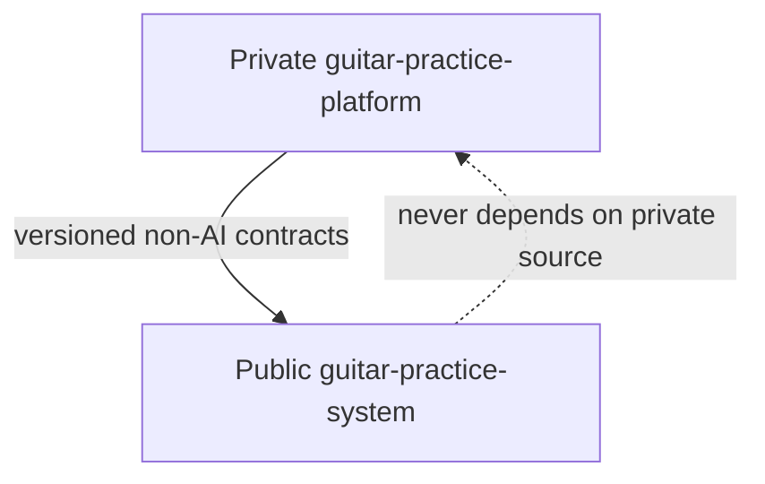
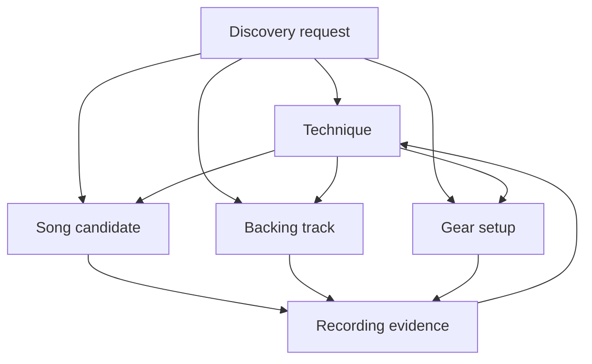
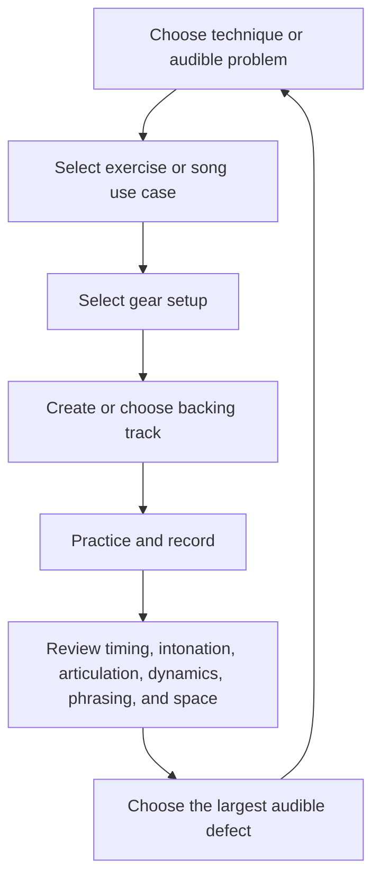

# Guitar Practice System

**Status:** public, AI-independent reference core

A technique-centred guitar practice and backing-material system for developing style, sound, rhythm, vocabulary, and writing instincts.

This repository owns portable musical concepts, deterministic workflows, schemas, validators, templates, examples, and local-first tools. It does **not** own AI capabilities.

## Repository boundary

All AI-related work belongs exclusively in the private `guitar-practice-platform` repository, including:

- prompts and prompt templates
- model providers, routing, orchestration, tools, and agents
- AI-assisted discovery, retrieval, recommendation, coaching, generation, and evaluation
- embeddings, model-derived metadata, datasets, traces, guardrails, and experiments
- AI-specific schemas, interfaces, fixtures, examples, issues, documentation, and roadmap work

The public repository may contain only domain contracts and deterministic behavior that remain independently useful without mentioning or depending on AI.



Anything already committed publicly must be treated as disclosed; removing an active file does not erase Git history. Former public prompts have been copied into a private provenance area, but they are not confidential or commercially differentiating.

See:

- [`docs/decisions/ADR-0002-public-core-product-boundary.md`](docs/decisions/ADR-0002-public-core-product-boundary.md)
- [`docs/decisions/ADR-0003-private-ai-ownership.md`](docs/decisions/ADR-0003-private-ai-ownership.md)
- [`docs/governance/ip-boundary.md`](docs/governance/ip-boundary.md)

## Model

The system has four practice layers plus deterministic discovery:

1. **Techniques** — progression, practice, and assessment
2. **Songs / repertoire** — musical use cases for techniques
3. **Gear / signal chains** — repeatable operational setups
4. **Backing tracks / production** — portable accompaniment
5. **Discovery** — deterministic catalog search and advisory ranking without state mutation



Optional musical dimensions describe realization: harmony, rhythm, fretboard navigation, ear training, genre vocabulary, phrasing, dynamics, articulation, and intentional space.

## Goals

- Make technique development the centre of the practice system
- Build focused paths for slide, wah, E-Bow, and useful country-picking branches
- Treat songs as technique use cases rather than the primary organization
- Keep gear inventory separate from learning progress
- Develop rhythm, timing, articulation, phrasing, dynamics, space, and arrangement
- Generate portable MIDI and backing-track source specifications
- Keep canonical material inspectable and DAW-neutral

## Core workflow



## Quick start

```bash
git clone https://github.com/ryjen/guitar-practice-system.git
cd guitar-practice-system
python -m unittest discover -s tests -v
mkdir -p generated
```

Suggested path:

1. Define a technique with [`templates/technique.md`](templates/technique.md)
2. Add only the musical dimensions needed for the goal
3. Compose a bounded session with [`templates/practice-session.md`](templates/practice-session.md)
4. Link a song section with [`templates/song-use-case.md`](templates/song-use-case.md)
5. Capture the setup with [`templates/gear-setup.md`](templates/gear-setup.md)
6. Specify accompaniment with [`templates/backing-track.md`](templates/backing-track.md)
7. Practice, record a short baseline, and retain only actionable evidence

## Design principles

- Technique is the primary learning layer
- Songs are musical use cases
- Gear is operational context, not progress
- Discovery is deterministic, advisory, and human-approved
- Space is intentional musical data
- Rhythm and feel before complexity
- Source specifications over generated artifacts
- Small playable units before complete arrangements
- Public contracts must be AI-independent
- Uncertain or AI-adjacent work starts private

## Artifact policy

- Markdown and small manifests are canonical
- Generated MIDI, notation, audio, and DAW files are outputs until curated
- Keep bulk generated artifacts under ignored paths
- Promote only owned or redistribution-safe material
- Do not store unauthorized complete tablature, notation, lyrics, stems, or recordings

## License status

This repository is publicly visible but currently has no explicit software license. Public visibility is not permission to use, modify, redistribute, sublicense, or create derivative works beyond rights provided by applicable law and GitHub’s terms.

## Contributing

Contributions should improve portable musical concepts, deterministic reference behavior, local-first workflows, schemas, validators, or synthetic examples.

AI-related changes are out of scope and belong in the private platform repository. Every pull request must complete the public disclosure checklist.
