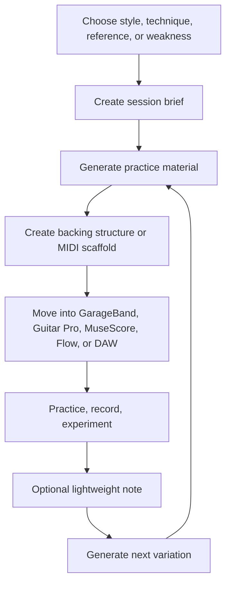

# Guitar Practice System

**Status:** early design / practice-material generation

A source-first system for generating playable guitar practice material from styles, techniques, references, moods, and weak spots.

The project is intentionally **practice-material-first**, not tracker-first. The core question is not “how do I measure every session?” It is:

> Given a style, technique, mood, reference, or weakness, what should I generate and play next?

## Overview

Most practice tools drift toward streaks, dashboards, habit metrics, and quantified progress. Those can be useful, but they are secondary here.

This repository focuses on producing concrete musical material:

- Session briefs
- MIDI scaffold specs
- Bassline-led grooves
- Drum cue structures
- Wah, delay, and E-Bow exercises
- GarageBand drummer settings
- Guitar Pro / MuseScore / Flow starting points
- Arrangement prompts and song-section maps
- Reusable prompts for generating new practice variations

The intended workflow is lightweight: generate something playable, move it into a DAW or notation tool, practice it, optionally capture what worked, then generate the next variation.

## Goals

- Generate useful practice sessions quickly
- Turn musical references into actionable traits without copying them
- Support expressive alternative, post-punk, ambient rock, and U2-adjacent vocabulary
- Create reusable source specs before committing generated artifacts
- Make generated material portable across GarageBand, Guitar Pro, MuseScore, Flow, and DAWs
- Support MIDI, tab, rhythm, arrangement, bassline, and backing-track scaffolds
- Keep optional review lightweight and musically useful

## Non-goals

This is not intended to become:

- A habit tracker
- A streak app
- A quantified progress dashboard
- A DAW
- A full notation editor
- A social or gamified learning platform
- A replacement for a teacher
- A system that over-models every practice session

Tracking can exist as a thin optional layer, but it should not dominate the design.

## Core workflow



See [`docs/practice-material-workflow.md`](docs/practice-material-workflow.md) for the fuller workflow model.

## Example use cases

### Generate a focused practice session

Create a 30-minute session around a specific technique or sound, such as:

- Rhythmic wah comping
- Dotted-eighth delay hooks
- E-Bow drones and counterlines
- Post-punk bassline-led vamps
- Ambient swells over modal harmony

### Build backing material

Generate a song-form scaffold that can become a GarageBand, DAW, or notation project:

- Intro / verse / chorus / bridge structure
- Drum intensity cues
- Bassline movement
- Chord vamp options
- Dynamic arrangement notes

### Convert references into traits

Use reference artists or songs as input without treating them as material to clone:

- Groove feel
- Space and density
- Effects vocabulary
- Section contrast
- Call-and-response patterns
- Hook placement

### Preserve useful generated material

Keep source specs canonical, then promote only the material worth reusing.

Generated output should be disposable by default. Curated artifacts should carry enough source context to explain why they matter musically.

## Quick start

No runtime is required yet. The current system starts with prompts, templates, examples, and source specs.

```bash
# Clone the repository
git clone https://github.com/ryjen/guitar-practice-system.git
cd guitar-practice-system

# Browse the source material
find docs prompts templates examples -type f | sort

# Keep disposable generated exports local unless curated
mkdir -p generated
```

Suggested first pass:

1. Pick a style or technique from the docs
2. Start from a session or backing-track prompt
3. Generate a short playable sketch
4. Move the result into GarageBand, Guitar Pro, MuseScore, Flow, or a DAW
5. Save only the useful source spec or curated artifact

## Concepts

### Source-first generation

Markdown and JSON specs are the stable source of truth. Rendered MIDI, exported notation, and DAW files are outputs, not the canonical design.

### Musical intent before settings

Gear settings are useful only when they serve the musical goal. A wah or delay exercise should start with feel, role, timing, and arrangement purpose before pedal parameters.

### Fragments before full songs

The system should prefer small reusable fragments over fully composed pieces:

- A groove
- A transition
- A hook
- A drone bed
- A call-and-response phrase
- A verse/chorus contrast pattern

Fragments are easier to practice, mutate, and recombine.

### Lightweight review

Review should answer practical questions:

- Was this playable?
- Did it produce a useful sound?
- What should be varied next?
- Should this be promoted, discarded, or regenerated?

It should not become analytics drift.

## Artifact policy

Specs are canonical. Generated files are disposable until promoted.

- Keep source specs in Markdown or JSON
- Put bulk generated artifacts under `generated/`
- Keep `generated/` ignored by default
- Promote only curated MIDI or notation artifacts into stable project paths
- Pair promoted artifacts with a short note explaining musical intent
- Prefer small, reusable exercises over large opaque exports

## Roadmap

### Near term

- Expand prompt coverage for session generation, backing tracks, MIDI scaffolds, and arrangement variants
- Add more worked examples for wah, delay, E-Bow, post-punk bass, and ambient textures
- Define a consistent schema for MIDI scaffold specs
- Create a small curated set of reusable practice fragments

### Later

- Add generation scripts for MIDI and notation artifacts
- Add optional lightweight review capture
- Build a small evaluation corpus for generated material quality
- Explore AI-assisted coaching loops without making tracking the center of the system
- Improve portability across GarageBand, Guitar Pro, MuseScore, Flow, and DAWs

## Design principles

- Practice material over productivity mechanics
- Source specs over generated artifacts
- Musical intent over tooling novelty
- DAW-neutral structure with GarageBand as the first worked example
- Human-curated references, not blind style cloning
- Optional review, not progress-dashboard gravity
- Small playable units before complete arrangements

## Contributing

This project is early and opinionated. Useful contributions should improve the quality, portability, or repeatability of generated practice material.

Good contribution areas include:

- New session prompts
- Better scaffold schemas
- Worked examples
- MIDI generation experiments
- GarageBand / Guitar Pro / MuseScore workflows
- Practice-material evaluation criteria
- Clearer artifact promotion rules

Avoid contributions that push the project toward streak tracking, gamification, or dashboard-heavy analytics unless they are clearly optional and subordinate to practice-material generation.
