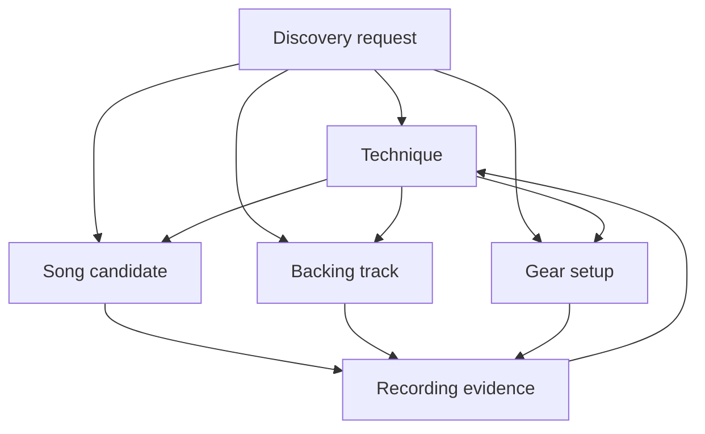
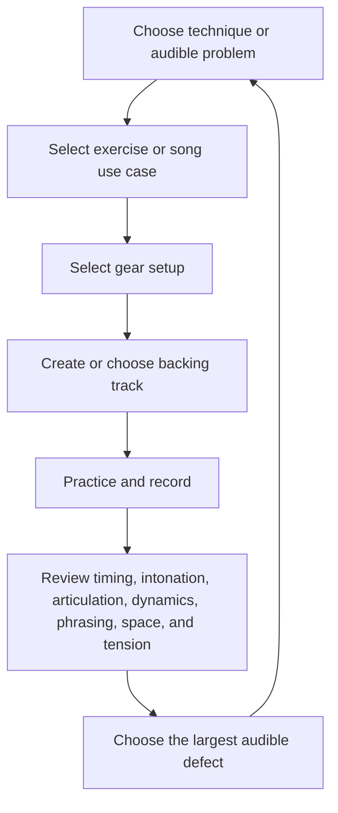

# Guitar Practice System

**Status:** early design / personal practice-material generation

A personal, technique-centred guitar practice and backing-track system for developing my own style, sound, rhythm, vocabulary, and writing instincts.

This repository is not trying to be a universal guitar-learning platform. It is a working system for helping me generate things I actually want to play: technique exercises, grooves, MIDI scaffolds, backing structures, arrangement cues, song use cases, and style-specific practice sessions.

The main focus is the wah / slide / E-Bow direction: atmospheric, expressive, rhythm-aware guitar built around movement, sustain, texture, and feel. Country picking and jazz vocabulary are optional branches that feed the same core sound through articulation, harmony, rhythm, phrasing, and voice leading.

The core question is:

> What technique should I develop, and what song, gear setup, or backing track will make it musical and testable?

## Model

The system has four connected practice layers plus a cross-cutting Discovery capability:

1. **Techniques** — the primary progression, practice, and assessment layer
2. **Songs / repertoire** — musical use cases for one or more techniques
3. **Gear / signal chains** — repeatable setups that support a sound or technique
4. **Backing tracks / production** — portable accompaniment for practice, improvisation, recording, and composition
5. **Discovery** — advisory search and ranking across the layers; it cannot mutate practice state without approval



The practice layers establish ownership. Optional musical dimensions then describe how a technique or practice item is realized: harmony, rhythm, fretboard navigation, ear training, genre vocabulary, phrasing, dynamics, articulation, and **space**.

Architecture references:

- [`docs/architecture/layered-practice-model.md`](docs/architecture/layered-practice-model.md) — ownership, relationships, progress, and evidence
- [`docs/architecture/musical-dimensions.md`](docs/architecture/musical-dimensions.md) — composable musical and expressive coordinates
- [`docs/architecture/reference-conventions.md`](docs/architecture/reference-conventions.md) — stable Markdown identifiers and identity/realization boundaries
- [`docs/discovery/README.md`](docs/discovery/README.md) — provider-neutral discovery, approval, provenance, and adapter boundaries

## Goals

- Develop my own guitar style and sound
- Make technique development the centre of the practice system
- Build focused paths for slide, wah, and E-Bow
- Branch into country picking when useful without creating a competing curriculum
- Treat songs as technique use cases rather than the primary organizational model
- Keep gear inventory and signal-chain presets separate from learning progress
- Build stronger rhythm, groove, timing, articulation, phrasing, dynamics, space, and arrangement instincts
- Generate reusable multi-instrument MIDI backing tracks for DAW import
- Create reusable source specs before committing generated artifacts
- Keep generated material portable across GarageBand, Guitar Pro, MuseScore, Flow, and other DAWs

## Core workflow



See [`docs/practice-material-workflow.md`](docs/practice-material-workflow.md) for the fuller material-generation workflow.

## Example use cases

### Develop a technique

Create a focused progression around:

- Slide intonation, vibrato, and muting
- Rhythmic or expressive wah control
- E-Bow activation, string changes, drones, and counterlines
- Hybrid picking and country articulation
- Bend intonation and vibrato
- Muted sixteenth-note rhythm work

### Use songs as validation

Map sections of a song to the techniques they exercise. Track song arrangement and performance separately from technique mastery. A full recorded take validates transitions, endurance, recovery, and musical context.

### Build backing material

Generate a portable arrangement scaffold with:

- Key, tempo, meter, feel, and form
- Drum, bass, keyboard, and optional complementary instrument parts
- Section and loop markers
- Technique-specific space and cues
- Type 1 MIDI with separately named tracks for DAW import
- Rendered-audio or DAW refinements as non-canonical outputs

### Capture gear setups

Document intent-driven setups for:

- Slide
- Wah
- E-Bow
- Country clean
- Hard-rock rhythm
- Recording and direct monitoring

Exact knob positions are secondary to signal-chain intent, sensitive parameter ranges, gain staging, and noise behaviour.

### Discover existing material

Search the repository catalog without changing songs, progress, schedules, or gear state:

```bash
python scripts/discovery_catalog.py search \
  examples/discovery/slide-backing-track-request.json \
  catalogs/discovery/repository.json
```

Provider output can be normalized through the same candidate contract before review.

## Quick start

No runtime is required for the documentation workflow. Optional standard-library Python helpers validate and generate repository assets.

```bash
git clone https://github.com/ryjen/guitar-practice-system.git
cd guitar-practice-system

find docs prompts templates examples -type f | sort
python -m unittest discover -s tests -v
mkdir -p generated
```

Suggested first pass:

1. Copy [`templates/technique.md`](templates/technique.md) and define a technique
2. Select or define supporting musical dimensions as needed:
   - [`templates/warmup.md`](templates/warmup.md)
   - [`templates/chord-progression.md`](templates/chord-progression.md)
   - [`templates/rhythm-meter.md`](templates/rhythm-meter.md)
3. Compose a bounded session with [`templates/practice-session.md`](templates/practice-session.md)
4. Link a song section with [`templates/song-use-case.md`](templates/song-use-case.md)
5. Capture the setup with [`templates/gear-setup.md`](templates/gear-setup.md)
6. Specify accompaniment with [`templates/backing-track.md`](templates/backing-track.md)
7. Practice and record a short baseline
8. Keep only the notes and promoted artifacts that help the next session

## Concepts

### Source-first generation

Markdown and small manifests are the stable source of truth. Rendered MIDI, exported notation, audio, and DAW files are outputs, not the canonical design.

### Technique first

Techniques own progression and quality gates. Exercises should exist because they address an audible musical problem or support a concrete musical use case.

### Core style first

The centre of gravity is wah / slide / E-Bow guitar: expressive motion, sustain, texture, rhythmic placement, and atmospheric arrangement.

Country picking and jazz belong when they strengthen that centre of gravity. They are vocabulary branches, not separate mandatory curricula.

### Musical intent before settings

Gear settings matter only in service of the part. Start with feel, role, timing, motion, and arrangement purpose before pedal or plugin parameters.

### Fragments before full songs

The system works best when it generates small reusable fragments: grooves, transitions, hooks, drone beds, rhythmic cells, slide phrases, chord movements, and call-and-response ideas. Songs then provide arrangement and performance use cases for those fragments and techniques.

### Space is musical data

Rests, delayed entries, early releases, sustained decay, response windows, and empty register are intentional choices. Space should be specified and reviewed whenever phrasing or arrangement is part of the goal; it must not disappear as an omitted event.

### Review as actionable memory

Review exists to choose the next practice target:

- Was this playable?
- Was timing, intonation, articulation, and muting credible?
- Did dynamics and phrasing create a recognizable musical shape?
- Did silence and arrangement space improve the part, or did I overplay?
- Did it sound like something I want more of?
- What was the largest audible defect?
- Should this be maintained, changed, discarded, or regenerated?

## Artifact policy

Specs are canonical. Generated files are disposable until promoted.

- Keep source specs in Markdown or small machine-readable manifests
- Put bulk generated artifacts under `generated/`
- Keep `generated/` ignored by default
- Promote only curated MIDI, notation, or audio artifacts into stable project paths
- Pair promoted artifacts with a short note explaining musical intent and provenance
- Prefer small, reusable exercises and arrangements over large opaque exports
- Do not store unauthorized complete tablature

## Roadmap

### Near term

- Complete the layered templates and worked examples
- Build focused technique paths for slide, wah, E-Bow, and country picking
- Define a consistent schema for backing-track and MIDI scaffold specs
- Generate one portable multi-track MIDI backing track and verify DAW import
- Add baseline recordings, quality gates, and regression checks
- Inventory current gear and capture repeatable technique-specific setups
- Extend Discovery from the local catalog into adaptive session recommendations

### Later

- Add deterministic notation generation scripts
- Build a curated set of reusable practice fragments and arrangements
- Add optional external Discovery providers behind the same normalization boundary
- Explore AI-assisted coaching loops around sound, rhythm, and arrangement
- Improve portability across GarageBand, Guitar Pro, MuseScore, Flow, and DAWs

## Design principles

- Technique is the primary learning layer
- Songs are musical use cases
- Gear is operational context, not progress
- Backing tracks are first-class portable assets
- Discovery is advisory and human-approved
- Musical dimensions are optional constraints, not competing curricula
- Space is intentional and explicit, not missing data
- Wah / slide / E-Bow remain the centre of gravity
- Country and jazz are optional vocabulary branches
- Rhythm and feel before complexity
- Source specs over generated artifacts
- Musical intent over tooling novelty
- Small playable units before complete arrangements
- DAW-neutral sources with practical DAW-specific import notes

## Contributing

This is a personal repository. Contributions, issues, or suggestions only make sense if they help the system produce better practice material for my style, sound, rhythm, or workflow.

Useful areas include better prompts, scaffold schemas, worked examples, MIDI generation experiments, DAW workflows, practice-material evaluation criteria, Discovery adapters, and clearer artifact-promotion rules.
