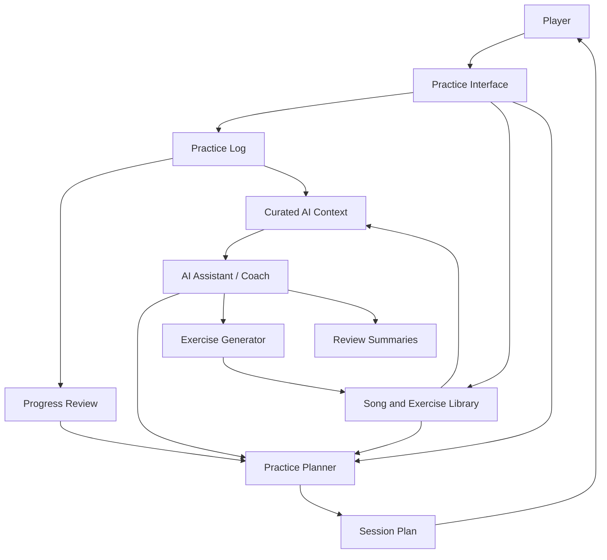

# Guitar Practice System

Status: **early design / planning**

A structured guitar practice and learning system for tracking practice, organizing material, generating exercises, reviewing progress, and eventually supporting AI-assisted coaching.

This repo starts as a documentation-first project. The goal is to define the practice model, data boundaries, workflows, and roadmap before committing to a specific app stack.

## Goals

- Track practice sessions, drills, songs, repertoire, and review notes
- Structure learning around technique, rhythm, ear training, theory, songs, and creative exploration
- Generate focused exercises and backing/practice material
- Review progress over time using lightweight metrics and qualitative notes
- Support future AI-assisted coaching without leaking unnecessary personal data
- Keep the system simple enough to use consistently

## Non-goals, for now

- Replacing a real teacher
- Building a full DAW
- Building a social network
- Optimizing for gamification before the practice model is validated
- Locking into a single app framework before workflows are understood

## Use cases

- Log a practice session with duration, focus areas, tempo, notes, and confidence
- Maintain a repertoire list with songs, sections, difficulty, tuning, capo, key, and status
- Track technique drills such as bends, alternate picking, chord transitions, muting, slides, wah control, and timing
- Generate warmups and exercises for a target style or weakness
- Review progress weekly and identify neglected areas
- Build practice plans from available time, goals, and recent history
- Export prompts, MIDI ideas, tabs, or backing-track specs for tools like GarageBand, Guitar Pro, MuseScore, or Flow

## Architecture overview



See [`docs/architecture.md`](docs/architecture.md) for the initial system model.

## Initial repository structure

```text
.
├── README.md
└── docs
    ├── architecture.md
    ├── decisions
    │   └── ADR-0001-project-direction.md
    ├── planning
    │   └── roadmap.md
    └── use-cases.md
```

## Suggested roadmap

1. Define the practice domain model and core workflows
2. Create a lightweight local data format for sessions, songs, drills, and reviews
3. Build a minimal CLI or notebook workflow for logging and weekly review
4. Add generated practice plans and exercise prompts
5. Add integrations for MIDI, tab, backing tracks, or playlist references
6. Add AI-assisted review and coaching with explicit privacy boundaries
7. Consider a web/mobile app once the workflow proves useful

## Local development

No application runtime has been selected yet.

Possible early options:

- Markdown + YAML/JSON files for zero-friction tracking
- Python scripts or notebooks for analysis and generation
- SQLite for local-first structured storage
- A small web app later if the data model stabilizes

Placeholder commands:

```bash
# clone the repo
git clone https://github.com/ryjen/guitar-practice-system.git
cd guitar-practice-system

# docs-first project for now
find docs -type f -maxdepth 3
```

## Design principles

- Practice-first, not tool-first
- Low-friction capture beats perfect modeling
- Prefer local-first/private-by-default storage
- Make AI context explicit and reviewable
- Track enough data to improve, not enough to become a chore
- Separate repertoire, exercises, sessions, and reviews
- Support creative exploration as well as skill acquisition

## Current status

This project is in the planning phase. The next useful step is to define the MVP data schema and pick the smallest runnable workflow for logging practice and reviewing progress.
