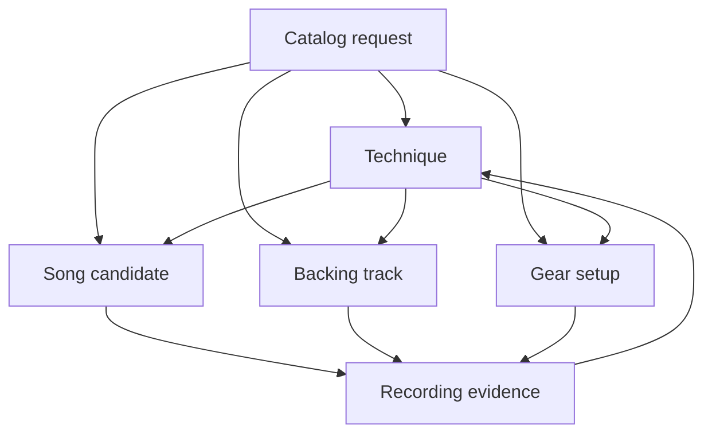
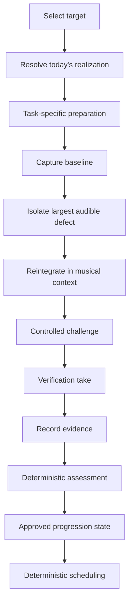

# Guitar Practice System

**Status:** public reference core / deterministic practice system

A technique-centred guitar practice and backing-track system for developing style, sound, rhythm, vocabulary, timing, phrasing, and writing instincts through explicit, portable source material.

This repository is not a hosted learning platform. It is a public reference core for techniques, musical dimensions, songs as use cases, gear context, backing tracks, practice sessions, evidence, deterministic scheduling, assessment gates, catalog discovery, and source-first artifact generation.

The core question is:

> What technique should I develop, and what explicit practice context will make it musical and testable?

## Model

The system has four connected practice layers plus deterministic catalog discovery:

1. **Techniques** — the primary progression, practice, and assessment layer
2. **Songs / repertoire** — musical use cases for one or more techniques
3. **Gear / signal chains** — repeatable setups that support a sound or technique
4. **Backing tracks / production** — portable accompaniment for practice, improvisation, recording, and composition
5. **Discovery** — reproducible catalog filtering and ranking; it cannot mutate practice state without approval



Optional musical dimensions describe how a technique or practice item is realized: harmony, rhythm, fretboard navigation, ear training, genre vocabulary, phrasing, dynamics, articulation, and **space**.

Architecture and workflow references:

- [`docs/architecture/layered-practice-model.md`](docs/architecture/layered-practice-model.md)
- [`docs/architecture/musical-dimensions.md`](docs/architecture/musical-dimensions.md)
- [`docs/architecture/reference-conventions.md`](docs/architecture/reference-conventions.md)
- [`docs/practice-session-workflow.md`](docs/practice-session-workflow.md)
- [`docs/discovery/README.md`](docs/discovery/README.md)
- [`docs/assessment/README.md`](docs/assessment/README.md)
- [`docs/scheduling/README.md`](docs/scheduling/README.md)

## Public boundary

This repository contains only independently useful, deterministic, implementation-neutral practice concepts, schemas, validators, algorithms, synthetic examples, and local-first workflows.

All public behavior must remain useful without external inference or opaque ranking. Missing information stays unknown rather than being guessed. Canonical state changes remain explicit and approval-gated.

Boundary governance is documented in:

- [`docs/decisions/ADR-0002-public-core-product-boundary.md`](docs/decisions/ADR-0002-public-core-product-boundary.md)
- [`docs/decisions/ADR-0003-private-ai-ownership.md`](docs/decisions/ADR-0003-private-ai-ownership.md)
- [`docs/governance/ip-boundary.md`](docs/governance/ip-boundary.md)

## Goals

- Make technique development the centre of the practice system
- Build focused paths for slide, wah, E-Bow, and optional country picking
- Treat songs as technique use cases rather than the primary organizational model
- Keep gear inventory and signal-chain presets separate from learning progress
- Build stronger rhythm, groove, timing, articulation, phrasing, dynamics, space, and arrangement instincts
- Use explicit metronome realizations and slow-to-target progression
- Generate reusable multi-instrument MIDI and notation artifacts from versioned source specs
- Maintain deterministic scheduling, maintenance, assessment, and catalog workflows
- Keep practice data portable and local-first

## Core workflow

A practice session follows the canonical closed loop documented in [`docs/practice-session-workflow.md`](docs/practice-session-workflow.md):



The core principle is: **plan → observe → isolate → reintegrate → verify → record → assess → schedule**.

## Deterministic discovery

Search the repository catalog without changing songs, progress, schedules, or gear state:

```bash
python scripts/discovery_catalog.py search \
  examples/discovery/slide-backing-track-request.json \
  catalogs/discovery/repository.json
```

The same request, catalog version, and ranking rules should produce the same candidate ordering.

## Deterministic scheduling

Generate an approval-gated practice schedule from an explicit normalized snapshot:

```bash
python scripts/scheduling_v2.py propose \
  examples/scheduling/v2-example-snapshot.json
```

The same snapshot, state revision, ruleset version, clock value, and timezone produce the same proposal. Scheduling uses the same canonical progression-state vocabulary as assessment while keeping active-work membership separate. It does not mutate progress or reinterpret evidence.

## Quick start

No runtime is required for the documentation workflow. Optional standard-library Python helpers validate and generate repository assets.

```bash
git clone https://github.com/ryjen/guitar-practice-system.git
cd guitar-practice-system

find docs templates examples -type f | sort
python -m unittest discover -s tests -v
mkdir -p generated
```

Suggested first pass:

1. Copy [`templates/technique.md`](templates/technique.md) and define a technique
2. Select supporting dimensions as needed
3. Read the canonical [`practice-session workflow`](docs/practice-session-workflow.md)
4. Compose a bounded session with [`templates/practice-session.md`](templates/practice-session.md)
5. Link a song section with [`templates/song-use-case.md`](templates/song-use-case.md)
6. Capture the setup with [`templates/gear-setup.md`](templates/gear-setup.md)
7. Specify accompaniment with [`templates/backing-track.md`](templates/backing-track.md)
8. Run baseline → isolation → reintegration → verification
9. Capture evidence and choose the next explicit action

## Concepts

### Technique first

Techniques own progression and quality gates. Exercises should exist because they address an audible musical problem or support a concrete musical use case.

### Musical intent before settings

Gear settings matter only in service of the part. Start with feel, role, timing, motion, and arrangement purpose before pedal or plugin parameters.

### Space is musical data

Rests, delayed entries, early releases, sustained decay, response windows, and empty register are intentional choices. Space should be specified and reviewed whenever phrasing or arrangement is part of the goal.

### Timing is explicit

A tempo is incomplete without beat unit, subdivision, click behavior, meter, grouping, and context. Slow, working, target, stretch, and internal-clock validation are separate practice realizations.

### Review as actionable memory

Review records what was observed and what explicit action should happen next. It does not invent hidden weaknesses or promote state from one best take.

## Artifact policy

Specs are canonical. Generated files are disposable until promoted.

- Keep source specs in Markdown or small machine-readable manifests
- Put bulk generated artifacts under `generated/`
- Promote only curated MIDI, notation, or audio artifacts into stable project paths
- Pair promoted artifacts with a short note explaining musical intent and provenance
- Do not store unauthorized complete tablature

## Roadmap

Near-term public work:

- stabilize deterministic scheduling and long-term progression contracts
- stabilize deterministic assessment gates and evidence semantics
- real-session validation of the multidimensional model
- timing/metronome integration
- deterministic catalog filtering and ranking
- MIDI, notation, and backing-track source workflows

See [`docs/planning/roadmap.md`](docs/planning/roadmap.md).

## Design principles

- Technique is the primary learning layer
- Songs are musical use cases
- Gear is operational context, not progress
- Backing tracks are first-class portable assets
- Discovery is deterministic, advisory, and human-approved
- Musical dimensions are optional constraints, not competing curricula
- Space is intentional and explicit
- Rhythm and feel before complexity
- Source specs over generated artifacts
- Musical intent over tooling novelty
- Small playable units before complete arrangements
- DAW-neutral sources with practical DAW-specific import notes
- Public contracts remain deterministic and implementation-neutral

## Contributing

Contributions should improve portable practice material, deterministic public contracts, synthetic fixtures, validators, source transformations, or safe local-first workflows. Every pull request must satisfy the public disclosure and boundary checklist.
