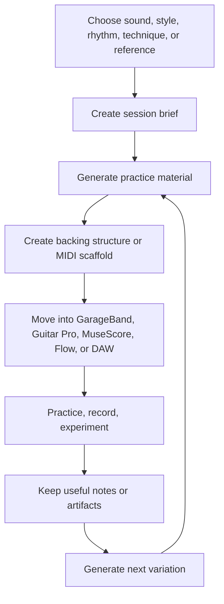

# Guitar Practice System

**Status:** early design / personal practice-material generation

A selfish guitar practice system for developing my own style, sound, rhythm, vocabulary, and writing instincts.

This repository is not trying to be a universal guitar-learning platform. It is a working system for helping me generate things I actually want to play: grooves, exercises, MIDI scaffolds, backing structures, arrangement cues, and style-specific practice sessions.

The main focus is the wah / slide / E-Bow direction: atmospheric, expressive, rhythm-aware guitar built around movement, sustain, texture, and feel. Jazz vocabulary is welcome here, but as a source of harmony, rhythm, phrasing, and voice-leading ideas that can feed that core sound.

The core question is:

> What should I generate, play, mutate, record, or revisit next to move my sound forward?

## Overview

This is a personal practice-material workbench.

It exists to help me turn musical intent into concrete material:

- Session briefs
- MIDI scaffold specs
- Bassline-led grooves
- Drum cue structures
- Wah, slide, delay, and E-Bow exercises
- GarageBand drummer settings
- Guitar Pro / MuseScore / Flow starting points
- Arrangement prompts and song-section maps
- Reusable prompts for generating new practice variations

The intended loop is simple: generate something playable, move it into a DAW or notation tool, practice it, record or sketch with it, keep what works, and generate the next variation.

## Goals

- Develop my own guitar style and sound
- Build stronger rhythm, groove, timing, and arrangement instincts
- Generate useful practice sessions quickly
- Create reusable source specs before committing generated artifacts
- Make generated material portable across GarageBand, Guitar Pro, MuseScore, Flow, and DAWs
- Center the wah / slide / E-Bow style: atmospheric, expressive, textural, and rhythm-aware
- Support expressive alternative, post-punk, ambient rock, and U2-adjacent vocabulary
- Add jazz vocabulary where it helps: richer harmony, substitutions, comping ideas, phrasing, swing feel, chord melody fragments, and voice-leading
- Explore wah, slide, delay, E-Bow, drones, hooks, bassline-led grooves, and atmospheric textures
- Keep notes lightweight and useful when they help the next session

## Core workflow



See [`docs/practice-material-workflow.md`](docs/practice-material-workflow.md) for the fuller workflow model.

## Example use cases

### Generate a focused practice session

Create a 30-minute session around a specific technique, feel, or sound:

- Rhythmic wah comping
- Slide phrases over droning harmony
- Dotted-eighth delay hooks
- E-Bow drones and counterlines
- Post-punk bassline-led vamps
- Ambient swells over modal harmony
- Muted sixteenth-note rhythm work
- Hook writing over a simple two-chord bed
- Jazz-flavoured chord movement under an atmospheric lead texture

### Build backing material

Generate a song-form scaffold that can become a GarageBand, DAW, or notation project:

- Intro / verse / chorus / bridge structure
- Drum intensity cues
- Bassline movement
- Chord vamp options
- Modal or jazz-leaning harmonic colour
- Dynamic arrangement notes
- Cue points for guitar hooks, swells, slides, fills, or texture changes

### Convert references into traits

Use reference artists or songs as directional input:

- Groove feel
- Space and density
- Effects vocabulary
- Section contrast
- Call-and-response patterns
- Hook placement
- Bassline and rhythm-guitar relationship
- Harmony, substitutions, and voice-leading ideas worth stealing as practice inputs

The point is not to clone references. The point is to extract useful traits and turn them into playable material.

### Preserve what works

Generated output is disposable by default. The useful things are the source specs, prompts, exercises, and curated fragments that help me get back to a sound later.

## Quick start

No runtime is required yet. The current system starts with prompts, templates, examples, and source specs.

```bash
# Clone the repository
git clone https://github.com/ryjen/guitar-practice-system.git
cd guitar-practice-system

# Browse the source material
find docs prompts templates examples -type f | sort

# Keep disposable generated exports local unless curated
mkdir -p generated
```

Suggested first pass:

1. Pick a sound, rhythm problem, technique, or reference
2. Start from a session or backing-track prompt
3. Generate a short playable sketch
4. Move the result into GarageBand, Guitar Pro, MuseScore, Flow, or a DAW
5. Keep only the useful source spec, note, or curated artifact

## Concepts

### Source-first generation

Markdown and JSON specs are the stable source of truth. Rendered MIDI, exported notation, and DAW files are outputs, not the canonical design.

### Core style first

The center of gravity is wah / slide / E-Bow guitar: expressive motion, sustain, texture, rhythmic placement, and atmospheric arrangement.

Jazz belongs in the system when it strengthens that center of gravity. That means using jazz as vocabulary, not as a separate academic lane: better chord movement, better comping, better phrasing, better voice-leading, and more interesting tension/release.

### Musical intent before settings

Gear settings matter, but only in service of the part. A wah, slide, delay, or E-Bow exercise should start with feel, role, timing, motion, and arrangement purpose before pedal parameters.

### Fragments before full songs

The system works best when it generates small reusable fragments:

- A groove
- A transition
- A hook
- A drone bed
- A rhythmic cell
- A slide phrase
- A chord movement
- A call-and-response phrase
- A verse/chorus contrast pattern

Fragments are easier to practice, mutate, recombine, and turn into songs later.

### Review as memory, not measurement

Review exists to help the next session. Useful questions are:

- Was this playable?
- Did it sound like something I want more of?
- What should change next?
- Should this be promoted, discarded, or regenerated?

## Artifact policy

Specs are canonical. Generated files are disposable until promoted.

- Keep source specs in Markdown or JSON
- Put bulk generated artifacts under `generated/`
- Keep `generated/` ignored by default
- Promote only curated MIDI or notation artifacts into stable project paths
- Pair promoted artifacts with a short note explaining the sound, rhythm, or musical intent
- Prefer small, reusable exercises over large opaque exports

## Roadmap

### Near term

- Expand prompt coverage for session generation, backing tracks, MIDI scaffolds, and arrangement variants
- Add more worked examples for wah, slide, delay, E-Bow, post-punk bass, and ambient textures
- Define a consistent schema for MIDI scaffold specs
- Create a small curated set of reusable practice fragments
- Add jazz-colour exercises that support the core sound rather than pulling the system into a separate jazz-practice track

### Later

- Add generation scripts for MIDI and notation artifacts
- Add lightweight review capture where it helps memory and reuse
- Build a small evaluation corpus for generated material quality
- Explore AI-assisted coaching loops around sound, rhythm, and arrangement
- Improve portability across GarageBand, Guitar Pro, MuseScore, Flow, and DAWs

## Design principles

- My sound first
- Wah / slide / E-Bow as the center of gravity
- Jazz as vocabulary, not a competing curriculum
- Rhythm and feel before complexity
- Practice material over productivity mechanics
- Source specs over generated artifacts
- Musical intent over tooling novelty
- Small playable units before complete arrangements
- DAW-neutral structure with GarageBand as the first worked example

## Contributing

This is a personal repository. Contributions, issues, or suggestions only make sense if they help the system produce better practice material for my style, sound, rhythm, or workflow.

Useful areas include:

- Better prompts
- Better scaffold schemas
- Worked examples
- MIDI generation experiments
- GarageBand / Guitar Pro / MuseScore workflows
- Practice-material evaluation criteria
- Clearer artifact promotion rules
