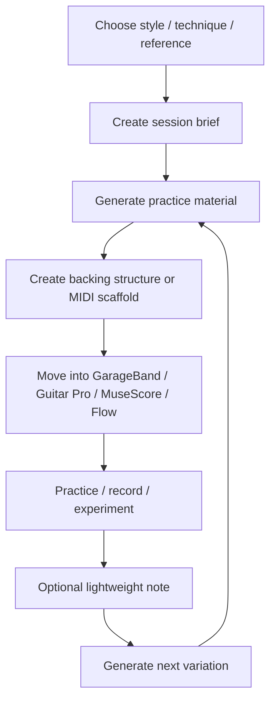

# Guitar Practice System

Status: **early design / practice-material generation**

A source-first guitar practice-material generation system for turning styles, techniques, references, moods, and weak spots into concrete things to play.

This is **not primarily a practice tracker**. Tracking may exist as lightweight notes, but the center of the project is generation:

- MIDI scaffolds
- backing-track structures
- rhythm and bassline prompts
- wah / delay / E-Bow exercises
- GarageBand drummer specs
- Guitar Pro / MuseScore starting points
- song-section practice briefs
- style-specific session prompts

## Core idea

Most practice systems drift toward productivity mechanics: streaks, dashboards, analytics, and habit tracking. This project intentionally avoids that center of gravity.

The useful question is:

> Given a style, technique, mood, reference, or weakness, what playable material should I generate next?

## Primary goals

- Generate useful guitar practice sessions quickly
- Create reusable prompts and templates for practice material
- Support MIDI, song-form, rhythm, and backing-track scaffolds
- Make generated material portable to GarageBand, Guitar Pro, MuseScore, Flow, or a DAW
- Focus on expressive alternative / post-punk / ambient rock vocabulary
- Support wah, delay, E-Bow, drones, hooks, bassline-led grooves, and arrangement practice

## Secondary goals

- Capture lightweight notes about what was useful
- Preserve useful generated material for reuse
- Keep references, cues, and prompts organized
- Allow optional review without turning the project into analytics software

## Non-goals

- Habit tracking
- Streak tracking
- Quantified progress dashboards
- Replacing a teacher
- Building a DAW
- Building a full notation editor
- Building a social/gamified practice platform
- Over-modeling every practice session

## Workflow



See [`docs/practice-material-workflow.md`](docs/practice-material-workflow.md) and [`diagrams/practice-material-workflow.mmd`](diagrams/practice-material-workflow.mmd).

## Repository map

```text
docs/
  planning/project-plan.md
  system-overview.md
  practice-material-workflow.md
  style-map.md
  wah-and-expression.md
  ebow-and-sustain.md
  garageband-drummer-workflow.md
  midi-and-tab-workflow.md
  lightweight-review.md

prompts/
  session-generator.md
  backing-track-generator.md
  midi-scaffold-generator.md
  rhythm-groove-generator.md
  arrangement-expander.md
  guitar-pro-musescore-generator.md
  youtube-playlist-builder.md

templates/
  session-brief.md
  song-structure.md
  backing-track-spec.md
  midi-sketch-spec.md
  garageband-drummer-spec.md
  lightweight-review.md

examples/
  u2-wah-delay-session.md
  post-punk-driving-bass-session.md
  ebow-ambient-session.md
  garageband-drummer-example.md
  midi-scaffold-example.md

midi/
  exercises.json
  basslines/
  drum-cues/
  chord-vamps/
  song-forms/

tabs/
  README.md
```

## Artifact policy

Specs are canonical. Generated files are disposable until promoted.

- Keep source specs in Markdown or JSON
- Put bulk generated artifacts under `generated/`
- Keep `generated/` ignored by default
- Promote only curated MIDI or notation artifacts into `midi/curated/` or `tabs/`
- Pair promoted artifacts with a short source note explaining musical intent

## Good first use cases

- Generate a 30-minute U2-style rhythmic delay and wah session
- Build a post-punk bassline-led backing structure
- Create an E-Bow drone and counterline exercise
- Convert a reference track into actionable traits without copying it
- Draft GarageBand drummer settings for verse / chorus / bridge sections
- Generate a MIDI scaffold spec for a DAW import

## Local usage

No runtime is required yet. Start with prompts and specs.

```bash
# browse source docs
find docs prompts templates examples -type f | sort

# generated exports should stay local unless curated
mkdir -p generated
```

## Design principles

- Practice-material-first, not tracker-first
- Musical intent before gear settings
- Source specs before generated artifacts
- Fragments before full songs
- Human-curated references only
- Lightweight review, not analytics drift
- DAW-neutral model with GarageBand as the first worked example
