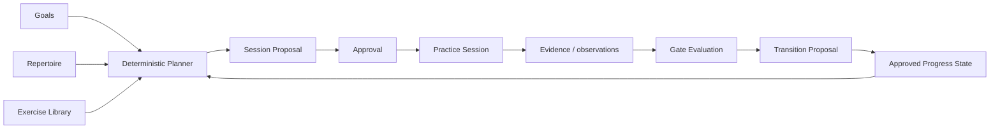
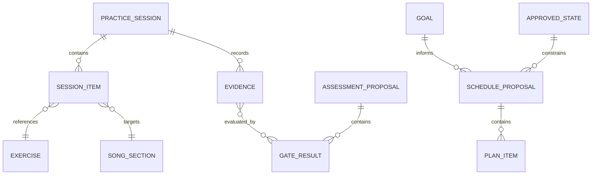

# Architecture

## Purpose

The guitar practice system helps a player convert explicit goals into repeatable practice, capture what happened, evaluate evidence against declared gates, and plan future work without hiding decisions inside opaque automation.

The architecture models the practice workflow before selecting an app stack.

## System model

The loop is:

1. Define goals and constraints
2. Produce or choose a valid plan
3. Practice
4. Capture useful evidence
5. Evaluate explicit gates
6. Approve state changes
7. Recalculate due work

## Core concepts

### Practice session

A bounded unit of work. It may include warmups, drills, song sections, creative exploration, recording, or review.

Suggested fields:

- date/time and timezone
- duration
- focus areas
- exercises attempted
- songs or sections practiced
- timing realization
- notes and explicit observations
- optional recording references

### Exercise

A reusable activity intended to improve a specific skill. Exercises include purpose, procedure, relevant constraints, stop conditions, and quality gates.

### Song / repertoire item

A piece of music the player wants to learn, maintain, or reference. Sections may progress independently and should link to external lawful references rather than copied protected material.

### Practice plan

A proposed set of activities for a time box.

Inputs may include:

- available time
- explicit goals and priorities
- approved progress state
- maintenance due state
- prerequisites
- environment and gear constraints
- recovery/load constraints supplied by the player

Outputs include:

- ordered activities
- time allocation
- timing realization
- deterministic selection/exclusion reasons
- conflicts or unresolved choices
- evidence task
- proposal version and stale-state semantics

### Assessment

Assessment evaluates supplied observations and evidence against explicit, versioned gates. It produces pass/fail/unknown/blocked/not-applicable results and may propose a progression transition. It does not infer missing observations.

## Data model sketch

This remains a domain sketch, not a committed persistence schema.

## State and proposal semantics

- Canonical state changes require explicit approval.
- Proposals carry input-state and ruleset versions.
- Applying a proposal is idempotent.
- Stale proposals are rejected or revalidated.
- Time-dependent rules use an injected clock and explicit timezone.
- Replaying the same versioned inputs produces the same deterministic result.
- Historical evidence and gate evaluations are append-only or superseded rather than silently rewritten.

## Candidate storage approaches

### Phase 1: file-based local-first data

Use Markdown plus YAML/JSON for capture, examples, and validation.

Pros:

- Easy to inspect and version
- No app required
- Deterministic fixtures are straightforward
- Works with Git

Cons:

- Querying gets awkward as history grows
- Validation must be explicit

### Phase 2: SQLite local database

Use SQLite when the model stabilizes and local querying provides enough value.

### Phase 3: application-backed storage

A runtime may be added after the domain contracts prove useful. Public contracts should remain independent from a particular UI or persistence technology.

## Integrations

Candidate deterministic integrations:

- GarageBand drummer/backing-track workflows
- MIDI generation/export
- MusicXML / Guitar Pro / MuseScore references
- recording or DAW bounce references
- tuner/metronome data
- calendar-compatible schedule export

External tools attach references or derived artifacts; core practice state remains portable.

## Security and privacy notes

Practice data can reveal habits, schedule, recordings, and personal creative work. Treat personal data as private by default.

Considerations:

- local-first storage
- explicit export/import boundaries
- no automatic upload of recordings
- synthetic public fixtures only
- secrets kept out of repository data
- external references instead of copied copyrighted tabs, lyrics, or recordings

## Open architecture questions

- Which contracts need machine-readable schemas versus Markdown guidance?
- Which workflows justify CLI support?
- How should local recordings be referenced without bloating the repository?
- What should be versioned in Git versus kept as local private state?
- Which metrics improve practice without creating false precision?
