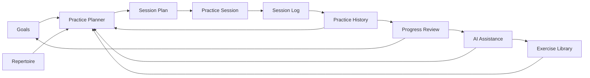
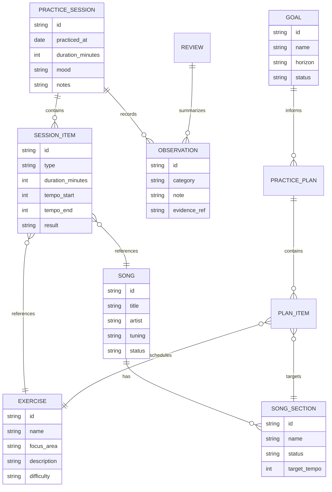
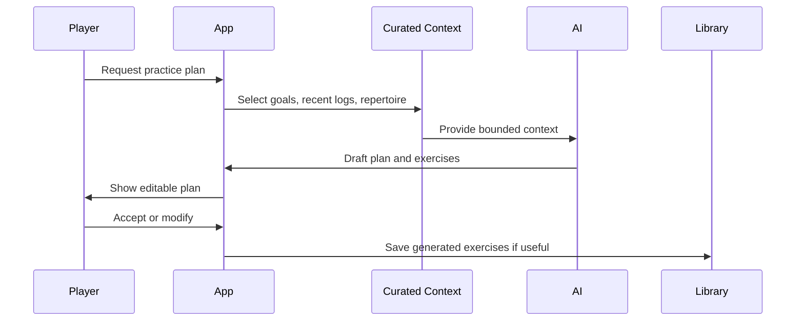

# Architecture

## Purpose

The guitar practice system helps a player convert goals into repeatable practice, capture what happened, and review progress over time. It should support structured learning without making practice feel like data entry.

The first architecture decision is to model the practice workflow before selecting an app stack.

## System model

The loop is the product:

1. Define goals
2. Plan practice
3. Practice
4. Log useful evidence
5. Review progress
6. Adjust the next plan

## Core concepts

### Practice session

A bounded unit of work. It may include warmups, drills, song sections, creative exploration, recording, or review.

Suggested fields:

- Date/time
- Duration
- Focus areas
- Exercises attempted
- Songs or sections practiced
- Tempo ranges
- Notes
- Friction points
- Confidence or self-rating
- Optional recording references

### Exercise

A reusable activity intended to improve a specific skill.

Examples:

- Wah timing over sixteenth-note funk rhythm
- Bend intonation drill
- Chord transition loop
- Muting and dynamics drill
- Alternate picking sequence
- Ear-training interval drill

### Song / repertoire item

A piece of music the player wants to learn, maintain, or reference.

Suggested fields:

- Title
- Artist
- Key
- Tuning
- Capo
- Sections
- Difficulty
- Target tempo
- Current status
- Notes
- External references

### Practice plan

A proposed set of activities for a time box.

Inputs:

- Available time
- Current goals
- Recent practice history
- Weak areas
- Upcoming deadlines or songs
- Desired style or mood

Outputs:

- Ordered activities
- Time allocation
- Target tempo or difficulty
- Review prompt
- Optional generated exercises

### Progress review

A periodic synthesis of logs and outcomes.

Review should include both quantitative and qualitative signals:

- Total time by focus area
- Songs moved forward
- Stale repertoire
- Tempo gains
- Repeated friction points
- Technique confidence
- Notes worth promoting into future plans

## Data model sketch

This is intentionally a sketch, not a committed database schema.

## Candidate storage approaches

### Phase 1: file-based local-first data

Use Markdown plus YAML/JSON for capture and review.

Pros:

- Easy to inspect and version
- No app required
- Good fit for AI-assisted summarization
- Works with Git

Cons:

- Weak validation unless schemas are added
- Querying gets awkward as history grows

### Phase 2: SQLite local database

Use SQLite once the model stabilizes.

Pros:

- Stronger querying
- Good local-first default
- Easy to export
- Works for CLI, desktop, mobile, or web later

Cons:

- More schema commitment
- Requires migration strategy

### Phase 3: app-backed storage

Add a web/mobile app only after the capture and review loop proves useful.

## AI-assisted workflows

AI should assist the practice loop, not own it.

Potential workflows:

- Generate a 20-minute warmup based on recent weak areas
- Create wah-focused rhythm drills over a target groove
- Suggest song-section practice order
- Summarize weekly practice logs
- Identify neglected skills or stale repertoire
- Convert musical goals into short practice blocks
- Generate prompts for MIDI, backing tracks, or drum grooves

## AI boundaries

AI-generated output should be treated as draft material.

Rules:

- Do not send full private history by default
- Use curated context packs
- Show the context used for generation
- Preserve user edits separately from generated drafts
- Keep generated exercises attributable
- Avoid pretending AI feedback is equivalent to a human teacher
- Prefer explainable recommendations over opaque scoring

## Future integrations

Candidate integrations:

- GarageBand drummer/backing-track workflows
- MIDI generation/export
- Guitar Pro or MuseScore references
- YouTube playlist references
- Recording files or DAW bounce references
- Tuner/metronome data
- Calendar reminders
- Wearable or health signals only if explicitly useful and privacy-safe

Integration principle: external tools should attach references or artifacts; the core practice history should remain portable.

## Security and privacy notes

Practice data can reveal habits, schedule, location, recordings, and personal creative work. Treat it as private by default.

Considerations:

- Local-first storage before cloud sync
- Explicit export/import boundaries
- No automatic upload of recordings
- Redact sensitive notes before AI calls
- Separate raw logs from AI context summaries
- Keep API keys out of repo data
- Avoid storing third-party copyrighted material directly
- Track source references instead of copying tabs, lyrics, or full transcriptions

## Open architecture questions

- Should the first runnable version be CLI, Markdown templates, or a small local web app?
- What is the minimum useful practice log schema?
- Should generated exercises be saved immediately or staged for review?
- How should recordings be referenced without bloating the repo?
- What should be versioned in Git versus kept as local private state?
- What level of metrics actually improves practice without creating overhead?
