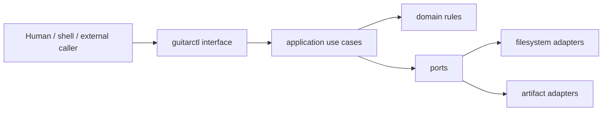

# CLI architecture

`guitarctl` is the stable command surface for Guitar Practice System. The CLI is an interface adapter, not the application architecture.

## Layering



Dependencies point inward:

- `guitar_practice.domain` contains pure deterministic musical/practice rules and value objects.
- `guitar_practice.application` coordinates use cases and defines ports.
- `guitar_practice.adapters` implements bounded side effects and migration bridges.
- `guitar_practice.interfaces.cli` parses arguments, dispatches commands, renders results, and maps failures to exit codes.

The domain must not import CLI, filesystem, network, process, or presentation code.

## Command design

Commands are grouped by capability rather than implementation file:

```text
guitarctl
├── discover search
├── schedule propose | check-approval
├── assess evaluate
├── session adapt
├── evidence feedback
├── groove validate | list | show
├── progression validate | list | show | resolve | fourths | generate
├── backing resolve | generate
├── midi generate | validate | generate-exercises
├── artifact build
├── export practice-data
└── validate repo | public-boundary
```

Legacy scheduling v1 remains available only through an explicitly marked compatibility namespace until its consumers are migrated.

## Stable process contract

The command surface follows these rules:

- stdout contains requested data or artifact locations only;
- stderr contains diagnostics;
- structured commands emit JSON by default;
- exit codes are stable and documented;
- relative paths resolve from one explicit workspace;
- stdin/stdout composition may be added where a command naturally consumes or produces one document;
- no command silently mutates canonical practice state;
- mutation requires an explicit action and the same deterministic validation used by every other caller.

These rules intentionally make the public core straightforward to call from shells, CI, desktop tools, services, or other external orchestration without coupling those callers to Python module topology.

## Migration boundary

The initial migration uses a registered legacy-process adapter for entrypoints that have not yet been extracted. This is a **strangler boundary**, not the desired final architecture.

A registered legacy command contains:

- a canonical `guitarctl` path;
- its temporary repository script target;
- any fixed argument prefix needed to preserve old behavior;
- migration state (`native`, `legacy`, or `deprecated`);
- no arbitrary shell command.

The adapter executes only registered repository-relative Python files and never invokes a shell. Package-native commands bypass this adapter entirely.

## Extraction sequence

For each cohesive subsystem:

1. identify deterministic computation and state invariants;
2. move that computation into `domain`;
3. move orchestration into `application`;
4. put filesystem/process/artifact concerns behind adapters;
5. route `guitarctl` to the package-native use case;
6. reduce the old script to a compatibility shim that imports package code;
7. migrate tests from `sys.path`/script imports to package imports;
8. migrate CI and docs to `guitarctl`;
9. delete the shim only after parity evidence exists.

Extraction is by subsystem rather than by file so closely coupled code moves together. The intended order is:

1. discovery;
2. scheduling + assessment;
3. evidence + adaptive sessions;
4. progression + timing;
5. MIDI + groove + bass + backing-track generation;
6. repository validation/export/build tooling.

## Patterns used

- **Functional core / imperative shell**: deterministic rules stay pure; I/O stays at the edge.
- **Ports and adapters / hexagonal architecture**: application code depends on capabilities, not concrete infrastructure.
- **Command pattern**: one registry maps stable command identities to handlers.
- **Strangler pattern**: legacy scripts remain usable while behavior moves behind stable interfaces.
- **Dependency inversion**: filesystem, clock, process, and artifact dependencies point outward.
- **Anti-corruption layer**: the legacy adapter translates the stable command surface to temporary old script conventions.

The goal is a boring, reproducible public core with a stable machine-facing surface and no requirement that callers understand repository internals.
