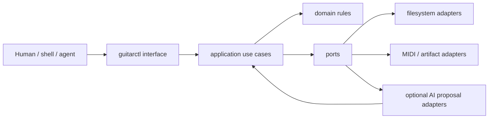
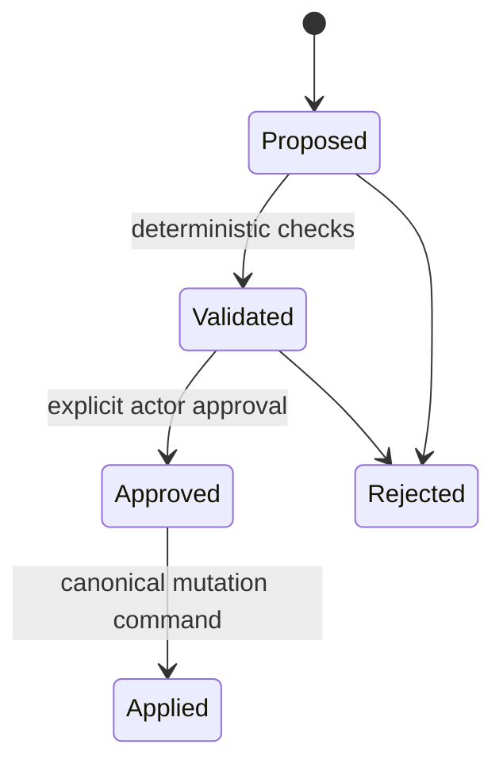

# CLI architecture

`guitarctl` is the stable command surface for Guitar Practice System. The CLI is an interface adapter, not the application architecture.

## Layering



Dependencies point inward:

- `guitar_practice.domain` contains pure musical/practice rules and value objects.
- `guitar_practice.application` coordinates use cases and defines ports.
- `guitar_practice.adapters` implements side effects and external integrations.
- `guitar_practice.interfaces.cli` parses arguments, dispatches commands, renders results, and maps failures to exit codes.

The domain must not import CLI, filesystem, network, provider SDK, model, or presentation code.

## Command design

Commands are grouped by capability rather than by implementation file:

```text
guitarctl
├── session
│   └── adapt
├── schedule
├── assess
├── discover
├── progression
│   └── generate
├── backing
│   └── generate
├── midi
│   ├── workflow
│   └── generate
├── export
└── validate
    └── public-boundary
```

The initial implementation routes existing script behavior through an isolated legacy adapter. This is a strangler migration boundary, not the desired final implementation. Each legacy script should be reduced to a compatibility shim as its logic moves into application/domain modules.

## CLI contract

The eventual command contract is:

- stdout contains requested data/artifacts only;
- stderr contains diagnostics;
- machine-readable JSON is available for commands that return structured data;
- exit codes are stable and documented;
- input paths may be replaced by stdin where practical so commands compose in Unix pipelines;
- no command silently mutates canonical practice state;
- mutation requires an explicit command/action and validation of the expected state revision.

## AI boundary

AI is an optional adapter behind `ProposalProvider`. It is never an implicit dependency of deterministic commands.

An AI-backed provider may generate or rank candidates such as:

- groove and backing-track ideas;
- MIDI arrangement proposals;
- practice-session suggestions;
- alternate progressions or voicings;
- explanations or review summaries.

It must not directly:

- promote assessment state;
- change canonical progression state;
- rewrite evidence;
- change the schedule;
- silently infer missing facts and persist them as truth.

AI output follows a proposal lifecycle:



Inference should carry provider/model/request identity plus input and output digests. The deterministic core validates the proposal using the same contracts used for human-authored material before approval.

This design allows a local specialist behind the Dubnium supervisor gateway, a remote frontier model, or no AI provider at all without changing domain behavior.

## Migration rules

1. New behavior goes into domain/application modules, not `scripts/`.
2. Existing scripts remain behavior-compatible until an equivalent `guitarctl` command has tests.
3. Extract pure computation first, then I/O behind ports, then make the script a shim.
4. Do not introduce provider SDKs into domain/application modules.
5. Keep deterministic fixtures for any workflow that an AI adapter can propose inputs for.
6. Persist provenance with promoted generated artifacts.
7. Remove legacy entrypoints only after documentation and CI use `guitarctl`.

## Patterns used

- **Ports and adapters / hexagonal architecture** for external systems.
- **Command pattern** for CLI capability dispatch.
- **Strangler pattern** for incremental script migration.
- **Dependency inversion** for storage, clocks, artifact generation, and AI.
- **Proposal + approval workflow** for non-deterministic generation.
- **Functional core / imperative shell** for deterministic rules versus I/O.

The intent is to keep the public core boring and reproducible while allowing increasingly capable automation around it.
