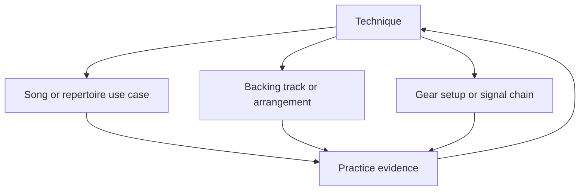

# Layered Practice Model

## Purpose

The practice system is technique-centric. Songs, gear, and backing tracks are supporting layers that make techniques musical, repeatable, and usable in real playing and recording contexts.

## Layers

### 1. Techniques

Techniques are the primary unit of progression and assessment.

Examples:

- Slide intonation and muting
- Rhythmic wah control
- E-Bow activation and string changes
- Hybrid picking
- Bend intonation
- Vibrato
- Muted rhythm articulation

A technique owns:

- Musical purpose
- Prerequisites
- Mechanics and failure modes
- Exercises
- Quality gates
- Progress state
- Evidence and maintenance cadence

### 2. Songs and repertoire

Songs are use cases for techniques. They provide motivation, arrangement context, transitions, endurance, and stylistic vocabulary.

A song does not own technique mastery. A song may be completed while a technique remains under development, and a technique may be reliable without any one song being complete.

A song owns:

- Structure and section map
- Technique references by section
- Tuning and tempo
- Learning and performance state
- Source links
- Full-take evidence

### 3. Gear and signal chains

Gear is a separate operational layer. It captures repeatable setups without making progress dependent on buying or owning specific equipment.

A gear setup owns:

- Instruments and accessories
- Signal-chain order
- Amp, plugin, and interface configuration
- Gain staging and noise considerations
- Setup intent
- Required, preferred, and optional components
- Troubleshooting notes

Exact settings are secondary to intent. Presets should describe what the setup is trying to achieve and which parameters are sensitive.

### 4. Backing tracks and production

Backing tracks are first-class practice and composition assets. Their canonical source should be portable and reproducible where practical.

A backing track owns its realization of:

- Key, mode, tempo, meter, feel, and form
- Referenced chord progression and rhythm definitions
- Chosen voicings and harmonic rhythm
- Instrument roles
- Loop and section markers
- Difficulty variants
- MIDI and rendered outputs
- DAW import notes
- Technique and song references

MIDI plus a small metadata manifest is preferred over a DAW-project-only source of truth. DAW projects remain valid refinement and mixing artifacts.

## Musical dimensions

The layers above establish ownership and lifecycle. Musical dimensions are optional reusable coordinates applied to a technique, exercise, song section, backing track, or session:

- Harmony, modes, progressions, and key traversal
- Rhythm, meter, grouping, groove, and harmonic rhythm
- Fretboard navigation such as CAGED, 3NPS, horizontal, intervallic, and triad views
- Interval and contextual ear training
- Genre vocabulary layers
- Phrasing, dynamics, articulation, sustain, and **space**
- Warmup and session-preparation constraints

Dimensions do not compete with technique ownership. They describe how the current musical task should be realized and reviewed. Missing optional dimensions are unconstrained, not incomplete.

See:

- [`musical-dimensions.md`](musical-dimensions.md) for the full model
- [`reference-conventions.md`](reference-conventions.md) for stable identifiers and identity/realization boundaries
- [`../../templates/practice-session.md`](../../templates/practice-session.md) for composing dimensions into a bounded session

## Cross-layer relationships

| Source | Relationship | Target |
|---|---|---|
| Technique | exercised by | Song section |
| Technique | practised over | Backing track |
| Technique | supported by | Gear setup |
| Practice session | composes | Technique and selected musical dimensions |
| Progression or rhythm | realized by | Song, backing track, exercise, or session |
| Song | uses | Backing track or arrangement |
| Song | suggests | Gear setup |
| Evidence | evaluates | Technique, song, or session target |

References should be explicit identifiers or relative links. Shared information should live in one layer or reusable dimension document and be referenced rather than copied.

## Progress and evidence ownership

Technique progression is the main learning state:

1. Discovered
2. Baseline recorded
3. Developing
4. Reliable in isolation
5. Reliable in musical context
6. Maintained

Songs use a separate delivery state:

1. Candidate
2. Mapped to techniques
3. Sections learned
4. Slow clean playthrough
5. Target-tempo playthrough
6. Recorded
7. Maintenance rotation

Evidence is lightweight metadata pointing to recordings stored outside Git when files are large. The repository should record date, context, tempo, setup, observations, and the next audible problem to address.

Expression evidence should include only relevant dimensions, but space must be explicit whenever phrasing or arrangement is assessed: rests, delayed entries, early releases, decay, response windows, density, and register reserved for other parts.

## Worked example

### Technique

`slide-single-note-intonation`

Goal: play sustained notes directly over the fret with controlled vibrato and clean muting.

### Song use case

A short melodic passage requiring sustained slide notes and movement between adjacent strings.

### Gear setup

Standard-tuned guitar, comfortable medium-action setup, glass or metal slide, clean-to-edge-of-breakup tone, moderate compression, restrained delay.

### Backing track

Slow 6/8 progression in E at 62 BPM with drums, bass, organ pad, and section markers. The track leaves space for a slide melody and supports looped two-bar intonation drills.

### Musical dimensions

The session may reference a reusable 6/8 rhythm, an E-centred progression, a low-fatigue slide warmup, wide-but-controlled vibrato, delayed phrase entries, and full sustained-note decay before the response phrase.

### Evidence

A baseline recording captures pitch accuracy, muting noise, vibrato width, timing, dynamics, space, and physical tension. The next session targets the largest audible defect.

## Constraints

- Markdown and simple manifests remain sufficient as the initial implementation.
- Avoid introducing a database or application until repeated manual work proves the need.
- Generated audio and DAW projects are outputs unless deliberately promoted.
- Do not store unauthorized complete tablature.
- Technique work should connect to an audible musical purpose.
- Do not rename existing stable IDs solely to adopt a new prefix convention.
- Space is intentional musical data, not an omitted event.
