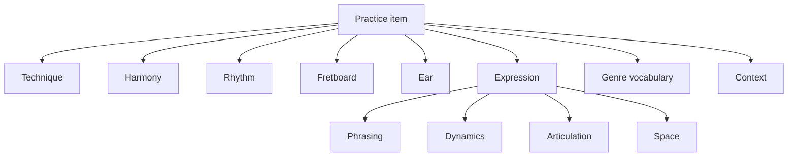

# Musical Dimensions and Expression Model

## Purpose

The practice system remains technique-centred, but a technique is never practised in a vacuum. Every useful practice item combines a small number of independent musical dimensions: harmony, rhythm, fretboard navigation, ear training, genre vocabulary, expression, and operational context.

These dimensions are not competing curricula. They are reusable coordinates that can be attached to techniques, exercises, fragments, songs, backing tracks, and practice sessions.



## Design rule

A practice item should specify only the dimensions that matter for its musical purpose. Missing dimensions mean "unconstrained", not "unknown".

For example, a slide-intonation drill may constrain technique, pitch target, tempo, and sustain while leaving genre and chord progression open. A country-blues improvisation session may constrain all dimensions.

## 1. Session preparation and warmups

Warmups are goal-directed preparation, not a detached exercise list. A warmup should state what later task it prepares and avoid unnecessary fatigue.

A warmup may include:

- Physical preparation: relaxed movement, finger independence, picking-hand synchronization
- Technique activation: bends, vibrato, slide contact, hybrid picking, E-Bow activation, wah timing
- Rhythmic preparation: subdivisions, accents, groove cells, odd-meter counting
- Harmonic preparation: scale degrees, arpeggios, chord-tone targeting, modal colour
- Ear preparation: singing or identifying intervals, roots, guide tones, or phrase endings
- Expressive preparation: dynamic range, attack variation, controlled silence, phrase breathing

Each warmup should capture:

- Target technique or session goal
- Duration or repetition bound
- Intensity and fatigue risk
- Tempo range
- Success cue
- Stop condition

A warmup is successful when the player is ready for the target task, not when the warmup becomes difficult.

## 2. Harmony

### Modes

Modes belong to harmonic context, not as an isolated memorization track. They should connect scale degrees, characteristic tones, chords, progressions, fretboard locations, ear recognition, and musical use cases.

Supported modal context should include at least:

- Ionian
- Dorian
- Phrygian
- Lydian
- Mixolydian
- Aeolian
- Locrian
- Major and minor pentatonic
- Blues scale
- Harmonic and melodic minor where useful

A modal exercise should identify its tonal centre and characteristic degree. For example, Dorian should emphasize the natural sixth rather than merely presenting a major-scale fingering from another root.

### Circle of fifths and fourths

The circle is a traversal strategy and relationship model rather than a single lesson.

It may be used to order:

- Keys and key signatures
- Scales and modes
- Chords and arpeggios
- ii-V-I or I-IV-V practice
- Blues in all keys
- Transposition
- Modulation and neighbouring-key exploration
- Ear-training prompts

Traversal strategies should include:

- Circle of fifths
- Circle of fourths
- Chromatic
- Relative major/minor
- Randomized
- User-selected key set

### Chord progressions

Chord progressions are first-class reusable objects. Songs and backing tracks reference them rather than owning duplicated progression definitions.

A progression may contain:

- Roman-numeral form
- Nashville-number form
- Concrete chords for a selected key
- Chord qualities and extensions
- Harmonic function
- Harmonic rhythm
- Meter and bar allocation
- Turnarounds, substitutions, passing chords, or pedal tones
- Genre associations
- Tension and resolution notes
- Variants and parent/derived relationships

Common progression families include:

- I-IV-V and I-V-IV
- ii-V-I
- iii-vi-ii-V
- I-V-vi-IV and vi-IV-I-V
- I-vi-IV-V
- I-bVII-IV
- Dorian and Mixolydian vamps
- Andalusian cadence
- Circle progressions
- Rhythm changes
- Coltrane changes
- Twelve-bar blues, quick-change, minor blues, jazz blues, and Bird blues

Non-standard progressions must be supported without forcing them into conventional functional harmony. They may be described through pitch centres, voice leading, modal mixture, chromatic mediants, pedal points, parallel motion, or deliberate ambiguity.

The system should distinguish:

- Progression identity: the abstract harmonic movement
- Voicing: how the chords are physically or orchestrationally expressed
- Arrangement: who plays each harmonic role and when
- Feel: how the progression is rhythmically delivered

## 3. Rhythm

Rhythm should be modeled as several related dimensions:

- Meter
- Subdivision
- Accent grouping
- Feel
- Tempo
- Groove
- Harmonic rhythm
- Phrase length

Common and non-common time signatures belong to the same model. Initial support should include:

- 2/4, 3/4, 4/4
- 6/8, 9/8, 12/8
- 5/4
- 5/8
- 7/4
- 7/8
- 11/8 and other additive meters when useful

Odd and additive meters must specify grouping, such as:

- 5/8 as 2+3 or 3+2
- 7/8 as 2+2+3, 3+2+2, or 2+3+2

The same meter can feel different depending on grouping and phrase placement. Counting should eventually give way to hearing and feeling the larger pulse.

## 4. Fretboard navigation

CAGED is a navigation system, not the theory itself. The system should allow the same musical concept to be viewed through multiple fretboard organizations.

Initial navigation systems:

- CAGED
- Three notes per string
- Horizontal or single-string movement
- Position-based playing
- Intervallic mapping
- Triad and arpeggio sets

CAGED relationships should connect:

- Chord shapes
- Triads
- Arpeggios
- Pentatonic scales
- Major scales and modes
- Chord tones
- Intervals
- Double stops
- Nearby voice-leading options

A lesson should not merely name a CAGED shape. It should state the root locations, chord tones, available colour tones, and how the shape connects to adjacent positions.

## 5. Interval and ear training

Intervals are foundational data shared by theory, fretboard knowledge, melody, harmony, phrasing, and ear training.

Training modes should include:

- Visual fretboard identification
- Construction from a root
- Melodic recognition
- Harmonic recognition
- Singing
- Interval inversion
- Scale-degree recognition against a tonal centre
- Chord-tone targeting
- Double-stop application
- Phrase transcription

Ear training should progress beyond isolated interval quizzes toward contextual hearing:

- Root and tonal-centre recognition
- Scale degrees
- Chord quality
- Chord function
- Progression recognition
- Mode colour
- Rhythmic dictation
- Phrase and melody transcription

## 6. Genre layering

Genres are composable vocabulary layers rather than mutually exclusive folders. A genre layer contributes tendencies, not hard rules.

A genre layer may describe:

- Harmonic vocabulary
- Rhythmic vocabulary and feel
- Typical forms and progressions
- Articulation
- Phrasing
- Dynamics
- Tone and production tendencies
- Common techniques
- Instrument roles
- Historical or regional relationships

Examples of useful composition:

- Southern rock: rock + blues + country
- Country rock: country + rock
- Jazz fusion: jazz + rock or funk
- Blues rock: blues + rock
- Bluegrass: country + folk with its own ensemble and articulation vocabulary

Layering allows prompts such as "country articulation over an eighties-rock progression" without claiming that every stylistic mixture is an established genre.

## 7. Expression

Expression is a first-class performance domain. It describes how notes are shaped, placed, connected, emphasized, and withheld.

### Phrasing

Phrasing dimensions include:

- Call and response
- Question and answer
- Motif and motivic development
- Repetition with variation
- Phrase length
- Phrase contour
- Entry and release points
- Tension and resolution
- Chord-tone targeting
- Ahead-of-beat, on-beat, or behind-the-beat placement
- Breathing and phrase boundaries

### Dynamics

Dynamics include both macro shape and note-level contrast:

- Dynamic floor and ceiling
- Crescendo and decrescendo
- Accents
- Ghost notes
- Pick or finger attack
- Muted-to-open contrast
- Volume swells
- Sustain decay
- Section-level intensity arcs

### Articulation

Articulation includes:

- Legato and staccato
- Hammer-ons and pull-offs
- Slides
- Bends and releases
- Vibrato
- Palm muting and fret-hand muting
- Rakes
- Harmonics
- Pick direction and attack angle where audible
- Fingerstyle and hybrid-picked emphasis

### Space

Space must be explicit. It is not merely the absence of notes or an informal phrasing suggestion.

The system should capture:

- Rest duration
- Phrase density
- Notes per phrase or per bar
- Time between phrases
- Delayed entry
- Early release
- Sustained-note decay before the next event
- Reserved frequency or register space for other instruments
- Call-and-response gaps
- Intentionally empty bars or beats

Space exercises may require:

- Playing one short phrase, then leaving an equal-length response window
- Limiting a solo to a maximum note count per bar
- Delaying each phrase until after beat one
- Ending phrases before the chord change
- Leaving every second bar empty
- Allowing a sustained note to decay fully before continuing

Space should be reviewed for musical effect, not maximized mechanically. Too much space can remove continuity; too little can destroy contrast, groove, and arrangement clarity.

## 8. Practice-item composition

A practice item references reusable concepts instead of duplicating them.

```yaml
id: expressive-dorian-call-response
intent: Develop vocal phrasing and controlled silence over a modal vamp

techniques:
  - bend-intonation
  - wide-controlled-vibrato

harmony:
  tonal_centre: A
  mode: dorian
  progression: a-minor-to-d-major-vamp

rhythm:
  meter: 7/8
  grouping: 2+2+3
  tempo_bpm: 74
  feel: straight

fretboard:
  systems:
    - caged
  region: fifth-position
  chord_shapes:
    - a-minor-e-shape

expression:
  phrasing:
    - call-and-response
    - repetition-with-variation
  dynamics:
    range: quiet-to-strong
    contour: crescendo-across-four-phrases
  space:
    minimum_rest_beats_between_phrases: 2
    empty_bars: every-second-pass
    maximum_notes_per_phrase: 6

ear:
  targets:
    - minor-third
    - natural-sixth
    - chord-tone-resolution

genre_layers:
  - blues
  - atmospheric-rock

evidence:
  review:
    - pitch accuracy
    - rhythmic placement
    - dynamic contrast
    - phrase identity
    - quality of silence and response space
```

## 9. Session shape

A generated practice session may use this structure:

1. **Prepare** — short goal-specific warmup
2. **Orient** — hear and locate the key, mode, meter, progression, or interval targets
3. **Isolate** — practise the main technique under reduced constraints
4. **Combine** — add rhythm, harmony, fretboard, or expression dimensions
5. **Apply** — use a song fragment, backing track, or improvisation prompt
6. **Record** — capture a bounded take
7. **Review** — identify the largest audible defect, including overplaying or ineffective space
8. **Retain** — keep, modify, discard, or schedule maintenance

Not every session requires every phase.

## 10. Implementation boundaries

Near-term implementation remains Markdown-first. Do not introduce a database or large ontology framework merely because the relationships are rich.

Start with:

- Stable identifiers
- Explicit links between documents
- Small reusable progression, rhythm, and practice-item specs
- Templates with optional sections
- Worked examples
- Validation only after repeated inconsistencies appear

Avoid:

- A mandatory comprehensive curriculum
- Treating CAGED as the only fretboard model
- Treating modes as fingering patterns without tonal context
- Treating genres as rigid taxonomies
- Treating odd meter as arithmetic without groove
- Treating expression as subjective and therefore unmodellable
- Treating space as empty or missing data
- Scoring every musical choice with false precision
