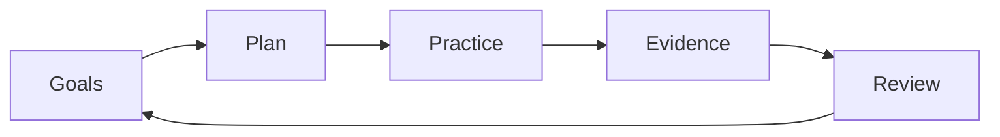

# ADR-0001: Project direction

## Status

Accepted for the public reference core. Repository-boundary details are superseded by ADR-0002 and ADR-0003.

## Context

The project is a guitar practice and learning system intended to structure practice, create reusable exercises and musical scaffolds, review progress, and preserve a portable practice model.

The main uncertainty is not the implementation stack; it is the practice workflow and domain model. Prematurely choosing a full application architecture would risk optimizing for UI or storage before validating the core loop:

The project should start with durable documentation and deterministic, portable contracts.

## Decision

Start as a documentation-first, local-first, practice-loop project.

Initial focus:

- define core concepts: sessions, exercises, songs, sections, plans, goals, observations, reviews, evidence, and progression
- capture realistic use cases before selecting a runtime
- prefer simple local data formats first
- keep personal practice data and recordings out of public repository history
- keep public behavior reproducible from explicit inputs and rules
- defer application framework selection until the workflow is stable

The first implementation should use the smallest mechanism that fits the validated workflow:

1. Markdown/YAML templates with scripts
2. a small CLI backed by local files
3. SQLite-backed local tooling when querying justifies it

## Consequences

### Positive

- avoids locking into the wrong application architecture too early
- keeps the project easy to inspect and change
- makes deterministic behavior and privacy boundaries explicit
- allows generated practice artifacts to be reviewed before becoming canonical
- preserves portability across future runtimes

### Negative

- no immediate polished application experience
- file-based tracking may become awkward as data grows
- more domain-design work happens before runtime implementation
- schemas may change after real practice usage

### Required follow-up

- define stable public contracts only where real workflows justify them
- create practice, evidence, assessment, and scheduling fixtures
- decide which workflows need CLI support
- add examples without exposing personal recordings or copyrighted material

## Alternatives considered

### Build a web or mobile app immediately

Rejected for now. It would force premature decisions about authentication, hosting, storage, UI state, and deployment before the practice model is proven.

### Use a spreadsheet as the primary system

Deferred. A spreadsheet may be useful as an import/export or dashboard layer, but it is not sufficient as the canonical representation for exercises, repertoire, evidence, timing realizations, and source artifacts.

### Use a DAW or notation tool as the system of record

Rejected. GarageBand, Guitar Pro, MuseScore, REAPER, and similar tools are useful consumers and integrations, but they are not good canonical stores for goals, practice history, review notes, or progression decisions.
