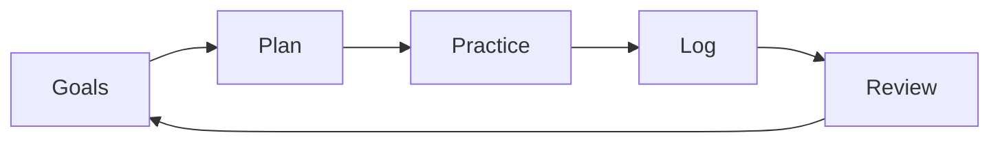

# ADR-0001: Project direction

## Status

Accepted for early planning.

## Context

The project is a guitar practice and learning system intended to help track practice, structure learning, generate exercises, review progress, and eventually support AI-assisted coaching.

The system is not yet an application. The main uncertainty is not the implementation stack; it is the practice workflow and data model.

Prematurely choosing a full app architecture would risk optimizing for UI, storage, or AI features before validating the core loop:

The project should start with durable documentation and a portable practice model.

## Decision

Start as a documentation-first, local-first, practice-loop project.

Initial focus:

- Define core concepts: sessions, exercises, songs, sections, plans, goals, observations, reviews
- Capture realistic use cases before selecting a runtime
- Prefer simple local data formats first
- Treat AI as an assistant for planning, generation, and review, not as the source of truth
- Keep private practice data and recordings out of public repo history
- Defer app framework selection until the MVP workflow is clear

The first implementation should probably be one of:

1. Markdown/YAML templates with scripts
2. A small CLI backed by local files
3. SQLite-backed local prototype

A web/mobile app can come later if the model proves useful.

## Consequences

### Positive

- Avoids locking into the wrong app architecture too early
- Keeps the project easy to inspect and change
- Supports AI-assisted workflows without requiring a cloud backend
- Makes privacy boundaries explicit from the beginning
- Allows generated practice material to be reviewed before it becomes canonical

### Negative

- No immediate polished app experience
- File-based tracking may become awkward as data grows
- More design work happens before implementation momentum
- Some schemas may change after real practice usage

### Required follow-up

- Define the MVP data schema
- Create practice-log and review templates
- Decide whether the first runnable prototype is CLI, scripts, or SQLite
- Define what belongs in the public repo versus private local data
- Add examples without exposing personal recordings or copyrighted material

## Alternatives considered

### Build a web app immediately

Rejected for now.

A web app may be useful later, but it would force premature decisions about authentication, hosting, storage, UI state, and deployment before the practice model is proven.

### Build a mobile app immediately

Rejected for now.

Mobile capture could be useful during practice, but native/mobile complexity is not justified before the core workflow is validated.

### Use a spreadsheet as the primary system

Deferred.

A spreadsheet is attractive for quick tracking and analysis, but the system also needs structured exercises, repertoire, reviews, generated artifacts, and possibly local files. A spreadsheet may still be useful as an import/export or dashboard layer.

### Make AI the central interface

Rejected.

AI should help generate plans, exercises, and summaries, but the canonical data model should remain explicit, inspectable, and portable. The player should be able to use the system without AI.

### Use a DAW or notation tool as the system of record

Rejected.

Tools like GarageBand, Guitar Pro, MuseScore, and Flow are useful integrations, but they are not good canonical stores for goals, practice history, review notes, and planning decisions.
