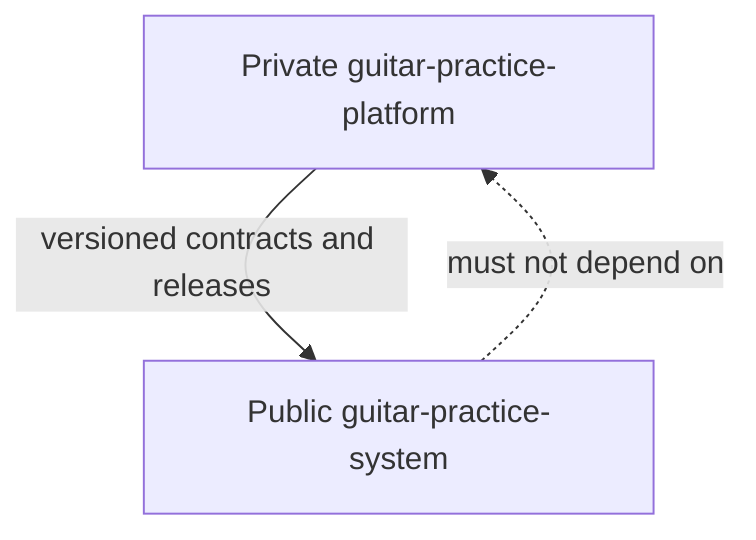

# ADR-0002: Public core and private product boundary

## Status

Accepted.

## Context

The repository began as a personal, local-first practice system. It now also serves as the reusable foundation for a separately operated commercial product.

A repository split is required to preserve a useful public core without publishing product-specific intellectual property, private data, licensed content, operational security details, or commercial strategy.

Moving a file after it has been committed publicly does not restore secrecy. Public Git history, forks, caches, package artifacts, and local clones may retain it. This boundary therefore governs all future work and treats prior public material as disclosed reference material.

Public visibility and source licensing are separate decisions. This repository currently has no explicit software license. It must not be described as open source unless an appropriate license is deliberately selected and added.

## Decision

Use a one-way public-core dependency model:

`guitar-practice-system` is the public reference core. It owns portable concepts, contracts, examples, and deterministic reference implementations.

`guitar-practice-platform` is the private product. It owns hosted services, production intelligence, proprietary content, customer data, and commercial operations.

The public repository must never require the private repository to build, test, validate, or explain its public contracts.

### Public core ownership

The public repository may contain:

- practice-domain vocabulary, schemas, and stable identifiers
- local-first file formats and import/export contracts
- provider-neutral discovery and evidence contracts
- deterministic validators and reference implementations
- reference prompts that intentionally demonstrate a public contract
- content-pack, backing-track, MIDI, and notation interfaces
- small synthetic or explicitly redistributable examples
- privacy, provenance, approval, and safety invariants
- public extension points and compatibility tests

Public implementations must be useful on their own. They must not be intentionally crippled merely to force use of the private product.

### Private product ownership

The private repository owns:

- accounts, identity, organizations, tenancy, and cloud synchronization
- billing, subscriptions, entitlements, trials, and marketplace settlement
- hosted APIs, workers, production infrastructure, deployment, and operations
- production AI prompts, model routing, evaluations, guardrails, and observability
- proprietary recommendation, ranking, adaptation, and next-best-action logic
- user, teacher, school, partner, and customer workflows
- personal recordings, practice history, telemetry, experiments, and cohorts
- premium curricula, licensed catalogs, editorial strategy, and unreleased content
- pricing, positioning, partnerships, forecasts, and product roadmaps
- secrets, credentials, production configuration, incident details, and threat intelligence

### Interface rule

Cross-repository integration must happen through explicit, versioned contracts. Prefer published schemas, packages, fixtures, or tagged releases over copying source between repositories.

A private capability may expose a generic interface publicly without exposing its implementation, training/evaluation data, production prompt, ranking weights, operational thresholds, or customer-derived insight.

### Default classification rule

When classification is uncertain, work starts in the private repository. It may later be promoted to the public core after deliberate generalization, provenance review, security review, licensing review, and removal of product-specific assumptions.

## Consequences

### Positive

- Preserves a credible and useful public project
- Prevents accidental publication of commercially sensitive implementation details
- Keeps private data and operational security outside public history
- Makes interfaces explicit and independently testable
- Allows selected private work to be publicly disclosed or licensed intentionally later

### Negative

- Requires duplicate planning and issue coordination across repositories
- Cross-repository contracts need versioning and compatibility discipline
- Some features require a public interface plus a separate private implementation
- Existing public material must be assumed disclosed even when later removed
- Public source cannot be safely assumed reusable until a license is chosen

## Required follow-up

- Apply the classification policy in `docs/governance/ip-boundary.md`
- Use the public pull-request checklist for every contribution
- Bootstrap the private repository with ownership, security, product, and architecture documents
- Inventory current public files and explicitly mark reference prompts and algorithms as public disclosures
- Keep commercial issues and implementation details out of the public issue tracker
- Review dependencies regularly to ensure the public repository never imports the private product
- Make a separate, deliberate licensing decision before inviting external reuse or contributions
