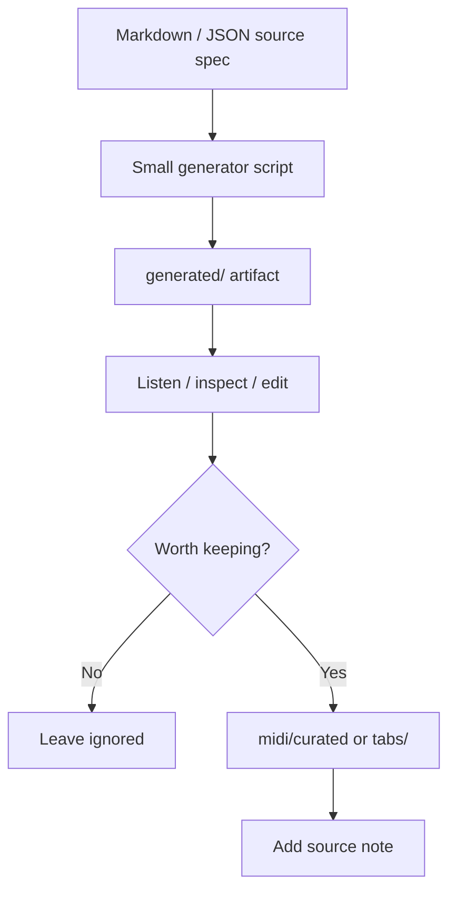

# MIDI and Tab Workflow

## Source-first policy

Generated files are outputs. Specs are source.

Use Markdown / JSON specs as the canonical representation until a generator stabilizes. This avoids committing opaque binary files before the musical model is clear.

## Default artifact flow



## Directory policy

- `generated/` — ignored scratch output
- `midi/exercises.json` — index of source exercises and curated candidates
- `midi/basslines/` — bassline specs or curated bassline MIDI later
- `midi/drum-cues/` — drum cue specs or curated MIDI later
- `midi/chord-vamps/` — chord vamp specs or curated MIDI later
- `midi/song-forms/` — section-level arrangement specs
- `tabs/` — notation guidance, MusicXML, MuseScore, or Guitar Pro notes

## Naming convention

Use descriptive, sortable names:

```text
YYYY-MM-DD-style-technique-key-bpm
2026-05-27-post-punk-bass-em-142
2026-05-27-u2-delay-wah-d-104
2026-05-27-ebow-drone-am-72
```

## MusicXML / MuseScore / Guitar Pro guidance

Prefer this order:

1. Markdown source spec
2. MIDI sketch for timing / scaffolding
3. MusicXML for notation interchange
4. MuseScore project for editing / rendering
5. Guitar Pro file only when guitar-specific notation matters

Do not treat MuseScore or Guitar Pro binaries as the only source of truth.

## Promotion rules

Promote an artifact only when:

- it was actually useful to practice
- it has a matching source note
- its tempo, key, style lane, and purpose are clear
- it is small enough to reuse
- it does not depend on undocumented DAW state

## First generator target

The first generator should render a simple MIDI scaffold from a constrained spec:

- tempo
- time signature
- section length
- bassline rhythm
- chord vamp
- drum cue notes

Avoid building a full composition engine at first.
