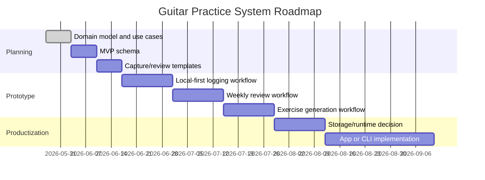

# Roadmap

## Current status

Early design / planning.

The repo currently defines the project direction, architecture sketch, and initial use cases. No runtime or application framework has been selected.

## Roadmap summary

Dates are placeholders. The sequence matters more than the calendar.

## Milestones

### M0: Documentation baseline

Goal: establish the project direction and avoid ambiguous implementation drift.

Deliverables:

- README
- Architecture document
- ADR for project direction
- Roadmap
- Use cases

Status: initial version complete.

### M1: MVP data model

Goal: define the smallest useful schema for tracking practice.

Deliverables:

- Practice session schema
- Exercise schema
- Song/repertoire schema
- Practice plan schema
- Review schema
- Example data fixtures

Definition of done:

- A week of realistic practice can be represented without obvious hacks
- The schema supports both structured fields and freeform notes
- Private/local-only data is clearly separated from repo examples

### M2: Capture workflow

Goal: make it easy to log practice without interrupting practice.

Deliverables:

- Practice log template
- Quick-capture format
- Example session logs
- Basic validation script or checklist

Definition of done:

- A session can be logged in under two minutes
- Logs can reference songs, drills, and observations
- Capture works without AI

### M3: Review workflow

Goal: turn logs into useful feedback.

Deliverables:

- Weekly review template
- Progress summary format
- Neglected-area detection
- Repertoire status review
- Basic charts or summary scripts, if useful

Definition of done:

- The system can answer: what improved, what stalled, what should come next?
- Reviews produce actionable next-practice recommendations
- Review output is editable by the player

### M4: Exercise and practice-plan generation

Goal: generate useful practice material from goals and history.

Deliverables:

- Prompt templates for exercise generation
- Practice-plan generator spec
- AI context-pack format
- Generated exercise staging workflow

Definition of done:

- Generated plans cite the context they used
- Generated exercises are staged before being added to the library
- The player can reject, edit, or promote generated material

### M5: Integration experiments

Goal: connect the system to actual music-making tools without making them required.

Candidate integrations:

- GarageBand drummer notes
- MIDI exercise export
- MuseScore / Guitar Pro references
- YouTube playlist references
- Local recording references
- Calendar reminders

Definition of done:

- Integrations attach useful artifacts or references
- Core practice data remains portable
- No copyrighted tabs, lyrics, or recordings are committed accidentally

### M6: Runtime decision

Goal: choose the smallest durable implementation path.

Options:

- Markdown/YAML plus scripts
- CLI plus local files
- SQLite-backed local app
- Local web app
- Mobile companion later

Decision criteria:

- Capture friction
- Query/reporting needs
- Data portability
- Privacy posture
- Maintenance cost
- Fit with AI workflows

## MVP scope

The MVP should support:

- Create and update practice goals
- Maintain a small repertoire list
- Maintain an exercise library
- Log practice sessions
- Run weekly reviews
- Generate a practice plan from goals and recent history
- Stage AI-generated exercises for review

The MVP does not need:

- User accounts
- Cloud sync
- Payments
- Social features
- Full notation editing
- Full DAW integration
- Real-time audio analysis

## Later phases

### AI coaching layer

Add AI support for:

- Practice-plan drafting
- Weekly review summarization
- Exercise generation
- Weakness detection
- Prompting reflection after sessions

Guardrails:

- Context must be explicit
- Generated output must be reviewable
- The canonical record remains user-controlled

### Music artifact generation

Add support for:

- MIDI drill generation
- Backing-track specs
- Drum groove prompts
- Chord progression exercises
- Call-and-response drills

### Rich application UI

Consider once workflows stabilize:

- Dashboard
- Repertoire board
- Practice timer
- Session capture UI
- Review timeline
- Exercise browser

### Recording and analysis

Possible future capability:

- Attach local recordings
- Mark sections needing review
- Track takes
- Compare self-ratings over time
- Optional pitch/rhythm analysis

This should be privacy-sensitive and local-first unless explicitly changed.

## Open questions

- What is the first implementation target: templates, CLI, SQLite, or web?
- How much structure should a practice log require?
- Should there be a fixed taxonomy of focus areas?
- How should creative exploration be tracked without over-formalizing it?
- What belongs in public repo examples versus private local data?
- Should AI prompts live in the repo as versioned artifacts?
- How should generated exercises be reviewed and promoted?
- Should repertoire track songs, sections, riffs, or all three separately?
- How should external references be stored?
- What metrics are worth tracking long term?
