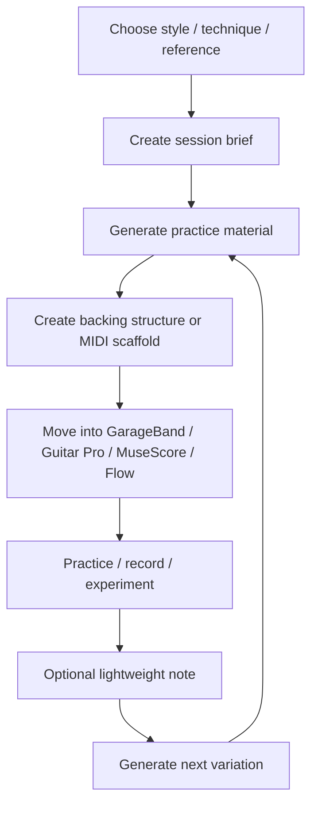

# Practice Material Workflow

## Purpose

Turn a vague practice impulse into a concrete playable artifact.

Examples:

- "I want more wah in my style"
- "Give me a U2-ish delay rhythm exercise"
- "I need a driving post-punk bass groove"
- "Make an E-Bow drone texture I can loop over"
- "Build a GarageBand drummer structure for this idea"

## Workflow



## Step 1 — Choose the input

Start with one strong input, not five weak ones.

Good inputs:

- style lane: post-punk, ambient rock, new wave, shoegaze
- technique: wah accents, E-Bow sustain, rhythmic delay, muted eighths
- reference traits: chiming delay, motorik bass, sparse arpeggios
- constraint: 20 minutes, one chord vamp, no fast playing

Avoid asking for a complete song immediately. Generate fragments first.

## Step 2 — Create a session brief

Use [`templates/session-brief.md`](../templates/session-brief.md).

The brief should answer:

- What am I practicing?
- What should it feel like?
- What gear or DAW assumptions matter?
- What output do I want?

## Step 3 — Generate material

Use one of the prompt files:

- [`prompts/session-generator.md`](../prompts/session-generator.md)
- [`prompts/backing-track-generator.md`](../prompts/backing-track-generator.md)
- [`prompts/midi-scaffold-generator.md`](../prompts/midi-scaffold-generator.md)
- [`prompts/rhythm-groove-generator.md`](../prompts/rhythm-groove-generator.md)
- [`prompts/arrangement-expander.md`](../prompts/arrangement-expander.md)

## Step 4 — Convert to a playable scaffold

A playable scaffold can be:

- chord vamp
- bassline loop
- drum cue map
- MIDI sketch
- GarageBand drummer spec
- MusicXML starting point
- Guitar Pro / MuseScore transcription plan

Prefer a small useful loop over a large vague arrangement.

## Step 5 — Practice and record

The system does not need to track everything. A quick voice memo, GarageBand project, or exported bounce is enough.

Capture only what helps generate the next version.

## Step 6 — Optional lightweight review

Use the three-question review:

```text
What was useful?
What should change?
What should be generated next?
```

Then feed the answer back into the next prompt.
