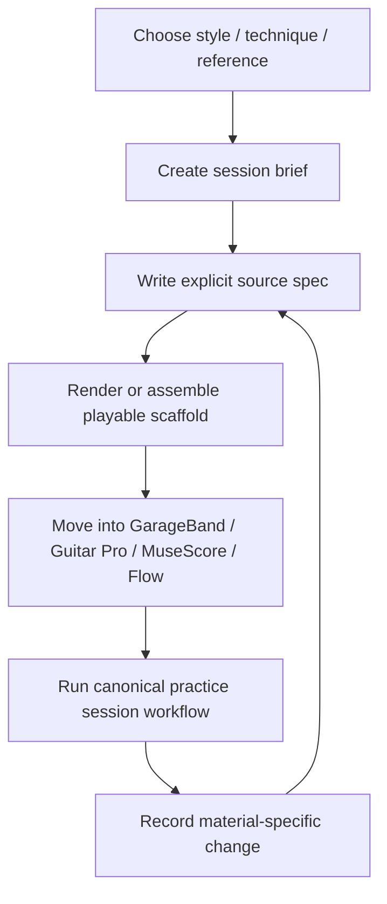

# Practice Material Workflow

## Purpose

Turn a vague practice impulse into a concrete playable artifact using explicit source specs.

This workflow owns **material creation and revision**. Once the material is ready to play, use the canonical [`practice-session-workflow.md`](practice-session-workflow.md) for the actual baseline → isolation → reintegration → verification → evidence loop.

Examples:

- "I want more wah in my style"
- "I want a rhythmic delay exercise"
- "I need a driving post-punk bass groove"
- "I want an E-Bow drone texture I can loop over"
- "I need a GarageBand drummer structure for this idea"

## Workflow



## Step 1 — Choose the input

Start with one strong input, not five weak ones.

Good inputs:

- style lane: post-punk, ambient rock, new wave, shoegaze
- technique: wah accents, E-Bow sustain, rhythmic delay, muted eighths
- reference traits: chiming delay, motorik bass, sparse arpeggios
- constraint: 20 minutes, one chord vamp, no fast playing

Avoid trying to design a complete song immediately. Start with fragments.

## Step 2 — Create a session brief

Use [`templates/session-brief.md`](../templates/session-brief.md).

The brief should answer:

- What am I practicing?
- What should it feel like?
- What gear or DAW assumptions matter?
- What output do I want?

## Step 3 — Write the source spec

Use the smallest template that owns the intended artifact:

- [`templates/practice-session.md`](../templates/practice-session.md)
- [`templates/backing-track.md`](../templates/backing-track.md)
- [`templates/midi-sketch-spec.md`](../templates/midi-sketch-spec.md)
- [`templates/rhythm-meter.md`](../templates/rhythm-meter.md)
- [`templates/chord-progression.md`](../templates/chord-progression.md)

The spec must contain the musical decisions required to reproduce the artifact. Missing information remains unconstrained rather than being inferred.

## Step 4 — Convert to a playable scaffold

A playable scaffold can be:

- chord vamp
- bassline loop
- drum cue map
- MIDI sketch
- GarageBand drummer spec
- MusicXML starting point
- Guitar Pro / MuseScore transcription plan

Prefer a small useful loop over a large vague arrangement.

## Step 5 — Run the practice session

Use [`practice-session-workflow.md`](practice-session-workflow.md) to conduct the actual session.

That workflow owns:

- task-specific preparation
- pre-drill baseline
- largest-defect isolation
- bounded metronome progression
- musical-context reintegration
- one controlled challenge
- comparable verification take
- evidence capture
- deterministic assessment and scheduling handoff

Capture only what helps evaluate the current goal and choose the next explicit change.

## Step 6 — Revise material only when the session exposes a material problem

Use the three-question review:

```text
What was useful?
What should change in the material?
What should be practised or created next?
```

A technique defect does not automatically require rewriting the backing track or exercise. Change the source material only when the session shows that the artifact itself is unclear, over-constrained, poorly arranged, or otherwise unsuitable.

Record the answer as source data for the next revision. No hidden inference is required.
