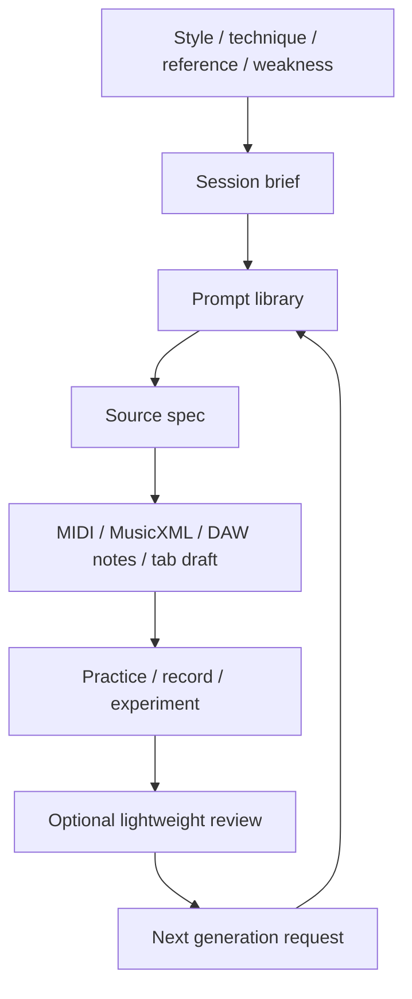

# System Overview

## Mental model

This repo is a **source-first practice-material generation system**.

The durable source of truth is not a MIDI export, GarageBand project, or tab file. The durable source is a small, readable spec that explains:

- the musical intent
- the style lane
- the technique focus
- the section structure
- the rhythm / bass / harmony scaffold
- the export target
- what should be generated next

Generated artifacts are useful, but disposable until curated.

## Architecture



## Core objects

### Session brief

A short document describing the practice goal, constraints, setup, and expected output.

### Backing-track spec

A DAW-neutral arrangement plan: tempo, key, sections, chords, groove, drummer feel, bass movement, and cue points.

### MIDI sketch spec

A structured representation of musical scaffolding: tracks, bars, notes, rhythm cells, chord vamps, and export assumptions.

### GarageBand drummer spec

A human-readable map from song sections to GarageBand drummer controls.

### Lightweight review

A small feedback loop with three questions only:

```text
What was useful?
What should change?
What should be generated next?
```

## AI role

AI is used to draft practice material, not to decide taste automatically.

Good AI outputs:

- playable fragments
- arrangement options
- practice constraints
- DAW setup notes
- MIDI source specs
- variations on accepted ideas

Bad AI outputs:

- vague advice
- fake precision
- imitation of artists instead of trait extraction
- over-modeled practice analytics
- generated artifacts without source specs

## Artifact policy

| Artifact | Canonical? | Location |
|---|---:|---|
| Markdown prompt | Yes | `prompts/` |
| Markdown template | Yes | `templates/` |
| MIDI sketch spec | Yes | `templates/`, `examples/`, later `midi/specs/` |
| Generated MIDI | No, unless curated | `generated/` by default |
| Curated MIDI | Yes, with source note | `midi/curated/` later |
| MusicXML | Maybe, if promoted | `tabs/` later |
| Guitar Pro binary | No, unless explicitly curated | avoid as source of truth |

## Practical starting point

Start with Markdown specs. Add scripts only after the spec shape stabilizes.

The first useful CLI helper should probably do one thing:

```bash
practice-material render-midi examples/midi-scaffold-example.md --out generated/example.mid
```

That keeps the system honest: specs first, artifacts second.
