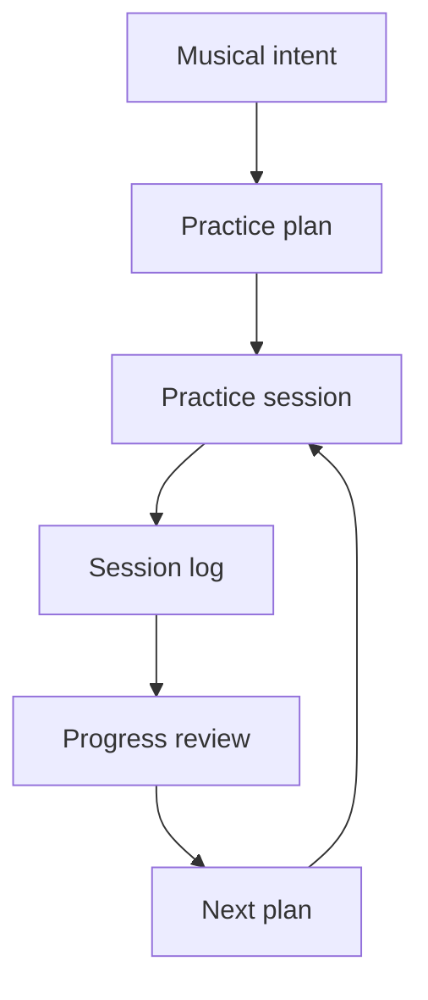
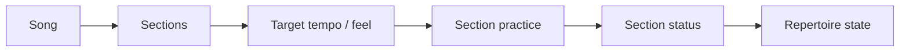
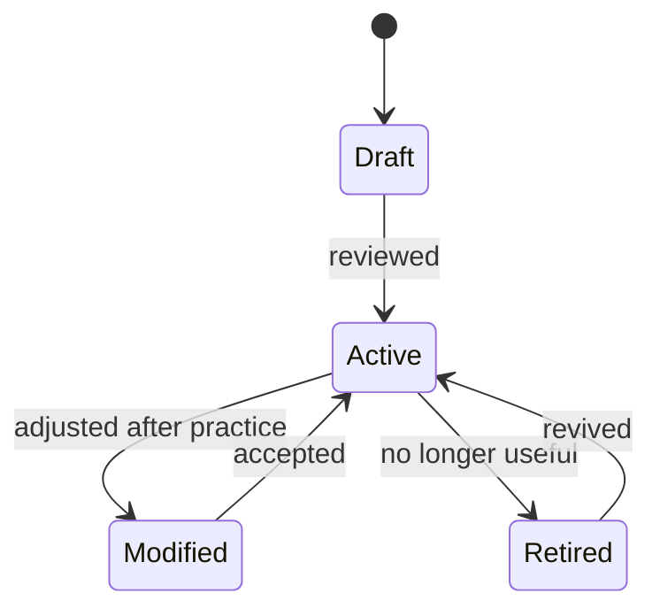
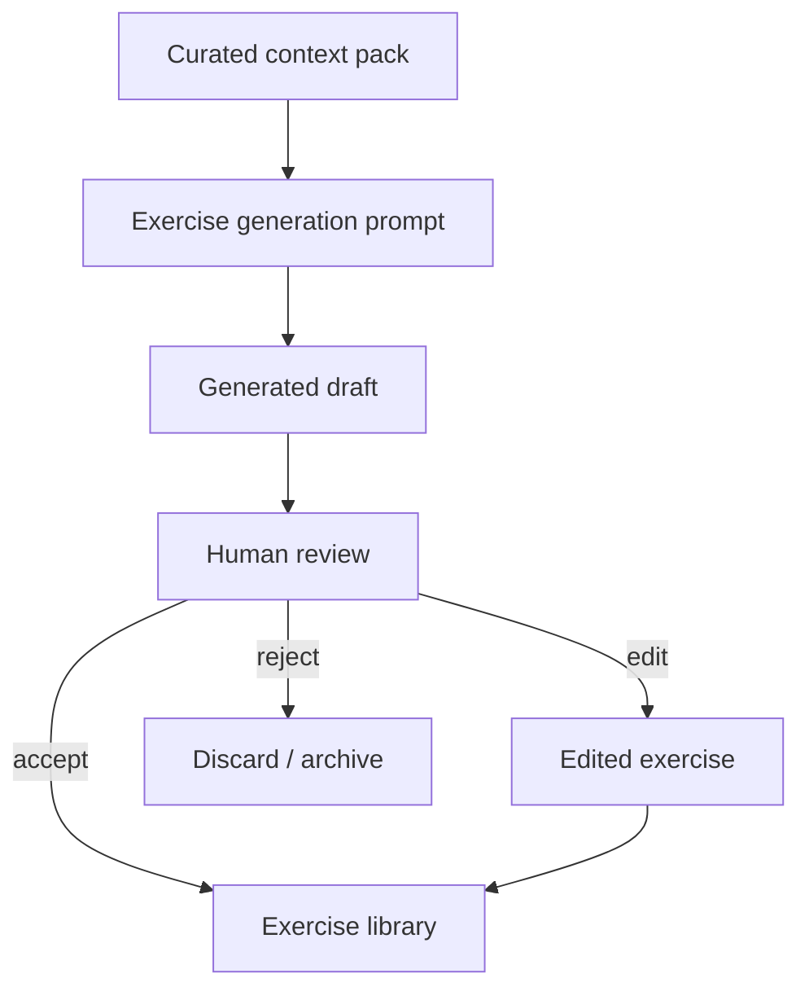
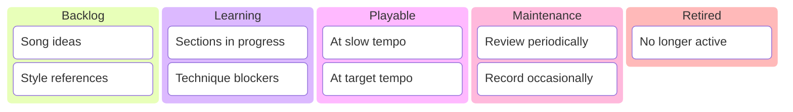

# Use Cases

## Overview

The system should help convert musical intent into repeatable practice. The core value is not just logging activity; it is closing the loop between goals, practice, review, and the next plan.



## 1. Practice tracking

### Goal

Capture what was practiced, what changed, and what should happen next.

### User story

As a player, I want to log practice sessions quickly so that I can review progress without turning practice into admin work.

### Inputs

- Date and duration
- Focus areas
- Exercises
- Songs or sections
- Tempo ranges
- Notes
- Self-rating or confidence
- Optional recording references

### Outputs

- Session log
- Updated progress history
- Observations for review
- Candidate next steps

### Example

```yaml
practice_session:
  date: 2026-05-27
  duration_minutes: 35
  focus:
    - rhythm
    - wah-control
    - repertoire
  items:
    - type: warmup
      name: chromatic muting warmup
      duration_minutes: 5
    - type: drill
      name: wah sixteenth-note accent drill
      duration_minutes: 10
      tempo_start: 70
      tempo_end: 82
    - type: song_section
      song: example-song
      section: chorus groove
      duration_minutes: 15
  observations:
    - wah timing improves when foot motion follows picking hand accent
    - chorus transition still late above 80 bpm
```

### Acceptance criteria

- A session can be logged quickly
- Freeform notes are allowed
- Structured fields are present where they improve later review
- Logs can reference exercises and repertoire

## 2. Song learning

### Goal

Break songs into learnable sections and track progress toward playable repertoire.

### User story

As a player, I want to track songs by section so that I can focus on the parts that actually need work.

### Core workflow



### Suggested statuses

- Backlog
- Listening
- Mapping
- Learning
- Playable slowly
- Playable at tempo
- Maintenance
- Retired

### Data to track

- Song title and artist
- Tuning, capo, key, tempo
- Sections
- Current status by section
- External references
- Notes on tone, rhythm, phrasing, or technique

### Acceptance criteria

- A song can be represented without storing copyrighted material directly
- Sections can progress independently
- Repertoire can be reviewed for stale or neglected songs

## 3. Technique drills

### Goal

Maintain reusable drills linked to specific technical outcomes.

### User story

As a player, I want drills organized by technique so that I can target weak areas instead of defaulting to the same comfortable material.

### Technique categories

- Timing and rhythm
- Picking
- Fretting-hand accuracy
- Bends and vibrato
- Slides and legato
- Chord transitions
- Muting and dynamics
- Wah / expression pedal control
- Ear training
- Theory application

### Exercise lifecycle



### Acceptance criteria

- Exercises have a purpose, not just a pattern
- Exercises can include tempo guidance
- Exercises can be generated, edited, promoted, or retired
- Practice logs can reference exercises by ID/name

## 4. Warmups

### Goal

Provide short, repeatable warmups matched to the session goal.

### User story

As a player, I want warmups that prepare me for the practice session instead of generic exercises that consume all my energy.

### Warmup types

- General finger mobility
- Timing and subdivision
- Muting and touch
- Picking-hand synchronization
- Chord grip preparation
- Wah/expression coordination
- Low-intensity song-section review

### Example warmup plan

```text
10-minute rhythm/wah warmup

1. 2 min: muted sixteenth-note strums at low tempo
2. 3 min: wah sweep on beats 2 and 4 only
3. 3 min: wah accents on selected sixteenth subdivisions
4. 2 min: apply to one chord vamp with relaxed dynamics
```

### Acceptance criteria

- Warmups are short and time-boxed
- Warmups can be selected based on session focus
- Warmups do not become the whole practice session by default

## 5. AI-generated exercises

### Goal

Use AI to generate draft practice material from explicit goals and recent practice context.

### User story

As a player, I want AI to suggest focused exercises so that I can practice weak areas creatively without manually designing every drill.

### Context inputs

- Current goals
- Recent practice notes
- Weak areas
- Preferred style references
- Available time
- Equipment constraints
- Repertoire targets

### Output requirements

Generated exercises should include:

- Purpose
- Skill target
- Duration
- Difficulty
- Tempo guidance
- Instructions
- Success criteria
- Variations
- Safety/fatigue notes where relevant

### AI workflow



### Acceptance criteria

- AI context is explicit and bounded
- Generated exercises are drafts until reviewed
- The system records whether an exercise was generated, edited, or manually created
- The player can reject generated material without polluting the library

## 6. Progress review

### Goal

Summarize practice history into useful next actions.

### User story

As a player, I want weekly reviews that tell me what improved, what stalled, and what to focus on next.

### Review dimensions

- Time spent by focus area
- Repertoire movement
- Exercises repeated
- Tempo changes
- Confidence changes
- Recurring friction points
- Missed goals
- Over-practiced comfort zones
- Under-practiced weak areas

### Weekly review output

```text
Week of YYYY-MM-DD

What moved:
- Song A verse is playable at slower tempo
- Wah timing improved on beat-level accents

What stalled:
- Chorus transition still breaks above 80 bpm

Patterns:
- Rhythm practice happened 3x
- Ear training was skipped

Next week:
- Keep wah drill, but reduce tempo and focus on clean accents
- Add 5-minute ear-training block twice
- Revisit Song B maintenance once
```

### Acceptance criteria

- Review output produces specific next actions
- Review can cite session logs or observations
- Review supports manual edits
- Review avoids fake precision when data is sparse

## 7. Repertoire management

### Goal

Track songs, riffs, sections, and maintenance needs over time.

### User story

As a player, I want to know which songs I am learning, which are playable, and which need maintenance.

### Repertoire board



### Data to track

- Song/riff/section name
- Artist/source
- Status
- Last practiced
- Last reviewed
- Difficulty
- Key/tuning/capo
- Target tempo
- Current tempo
- Notes
- External references

### Acceptance criteria

- Repertoire can be reviewed by status
- Stale songs can be detected
- Songs can be split into sections
- Maintenance practice can be scheduled
- External references are linked rather than copied wholesale

## Cross-cutting requirements

### Low-friction capture

The system should minimize typing during or immediately after practice.

### Local-first privacy

Practice history, recordings, and personal notes should be private by default.

### Explicit AI context

AI should only receive the minimum useful context for a task.

### Reviewable generation

Generated plans, drills, and summaries should be editable before promotion.

### Portability

The player should be able to export or migrate data without losing the practice history.
